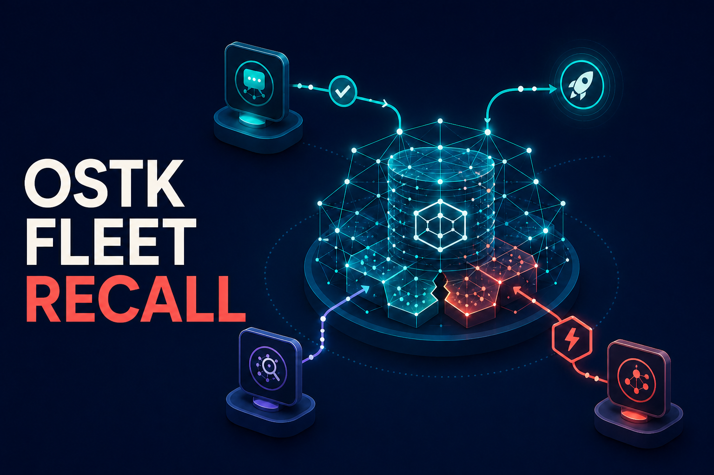

# ostk-fleet-recall



> **Agents are replaceable. Their memory shouldn't be—and when two disagree,
> memory should say so.**

Shared, durable semantic memory for agent fleets, backed by CockroachDB while
preserving Recall's local-first semantics and two-tool MCP contract. It works
with any MCP client; OSTK orchestration is an optional integration, not an
install or runtime requirement.

`ostk-recall` remains the private, local-first corpus powered by LanceDB and
SQLite. Fleet Recall is the distributed backend for agents that need to share
memory across processes and hosts. This repository is new work for the
CockroachDB AI Agents Hackathon and reuses the separately disclosed
[`ostk-recall`](https://github.com/os-tack/ostk-recall) project.

The implemented hackathon surface is intentionally small:

- `recall(search|get|conflicts|status)` reads hybrid vector/lexical corpus and
  typed-claim state.
- `remember(record)` records a deliberate typed claim with provenance,
  idempotent mutation receipts, and conflict detection.
- `ingest` is a trusted operator CLI for populating the active chunk corpus.
- `reference-agent` runs one bounded step of the deterministic rollout-safety
  policy used by the default AWS agent proof.
- `demo` is a bounded, read-only HTTP surface; it exposes no mutation route.

The reference policy agent is ordinary Fleet Recall application code: it
retrieves memory, applies an explicit deterministic policy, and records a cited
action. It does not invoke OSTK, an LLM, or a model API. The OSTK adapter is a
strictly optional interoperability path.

Attention schema space is reserved for future compatibility, but attention
actions and a runtime attention workflow are **not implemented** in this
hackathon slice. Additional canonical Recall actions are also future work.

## Evidence status

The submission candidate is live at
[https://d13zrqfh66r7ub.cloudfront.net](https://d13zrqfh66r7ub.cloudfront.net).
The schema-2 migration and both idempotent seed tasks completed against
CockroachDB Cloud. The deployed image contains the three-record bootstrap plus
a verifier-gated 536-chunk rich corpus. The public status surface reports
CockroachDB 26.2.5, schema version 2, enabled vector, lexical,
conflict-membership, and claim-support-chunk indexes, working cosine distance,
and the pinned 512-dimension embedding model.

The deployed ARM64 release is source commit
`ba884f24858a58b09a915e0358e60e7fcc7e2c34`, immutable image tag
`git-ba884f24858a`, and digest
`sha256:7d154a37fff589d2e68ec71c230025f3324cea96f85f7b51158f2d3097f2320b`.
The serving, migration, seed, and reference-agent task definitions are all
revision 6. GitHub Actions run
[`31808620621`](https://github.com/os-tack/ostk-fleet-recall/actions/runs/31808620621)
completed all five jobs successfully for that exact commit.

The checked-in, publication-safe
[source-conflict self-audit receipt](docs/evidence/self-audit-devpost-self-audit-20260814T133640Z-rev6.json)
proves that semantic recall surfaced the exact documentation and code sources
behind incompatible Boolean claims 9 and 10 and projected their exact open
conflict 3. The
[reference-agent receipt](docs/evidence/reference-agent-devpost-final6-20260814T143523Z.json)
then correlates decision, action, incompatible-decision, and escalation claims
15/16/17/18 with open conflict 5 across four one-off Fargate tasks. The
[replacement receipt](docs/evidence/replacement-devpost-final6-20260814T143523Z.json)
records a fully disjoint serving-task-set replacement that preserved exact
public claims 16 and 18 through lexical/dense RRF; the
[publication verifier receipt](docs/evidence/publication-validation-devpost-final6-20260814T143523Z.json)
cross-validates the pair. These are live AWS/CockroachDB Cloud results;
LocalStack and local tests remain preflight evidence only.

An earlier completed proof remains valid historical evidence, but it predates
the schema-2 and revision-6 release boundary. The current publication proof uses
a fresh `devpost-final6-20260814T143523Z` run ID so task, image, claim, conflict,
and replacement correlations cannot be confused with the prior deployment.

HTTPS is provided by CloudFront's default certificate. AWS fixes that
generated-hostname viewer policy at a TLSv1 minimum, although newer TLS can be
negotiated. CloudFront reaches the ALB over restricted HTTP, guarded by the
CloudFront origin-facing prefix list and a secret origin header, so this is not
an end-to-end-TLS or TLS-1.2-minimum claim.

The publication-safe
[CockroachDB Cloud `EXPLAIN` artifact](docs/evidence/cockroach-cloud-explain.txt)
records all assertions passing for the exact production project-vector,
source-vector, and lexical SQL shapes on a 10,001-row disposable fixture. The
plans select `memory_chunks_semantic_idx`,
`memory_chunks_source_semantic_idx`, and `memory_chunks_lexical_idx`. The
production database was untouched, the fixture database was dropped, and the
temporary workstation network rule was removed. The final public video and
remaining entrant/Devpost fields are still release gates. CI is green for all
five jobs at `ba884f24858a` in run `31808620621`.

The final-cut plan leads with the live AWS UI and then shows the reviewed cloud
agent and replacement receipts; see [`docs/VIDEO_DEMO.md`](docs/VIDEO_DEMO.md).
A standalone Fleet Recall MCP capture is optional local terminal footage, and a
verified OSTK render is an optional alternate. Neither substitutes for cloud
proof.

Keep the public judging deployment free and unrestricted
through **September 15, 2026 at 5:00 PM EDT / 4:00 PM CDT**. Do not scale it to
zero or tear down its AWS, CockroachDB Cloud, DNS/TLS, model, secret, logging,
or network dependencies before that hold expires.

## Local quickstart

This path starts one disposable CockroachDB node, loads the pinned 512-dimension
model, ingests the synthetic demo corpus, exercises HTTP recall, and makes real
MCP calls. A single node is useful for application development; it does not
demonstrate CockroachDB's production availability or distributed topology.

### Prerequisites

- [Rust](https://rustup.rs/) 1.94 or newer, including Cargo, rustfmt, and
  Clippy. The crate's MSRV is 1.94.
- [Docker Engine](https://docs.docker.com/engine/install/). Docker Desktop is
  sufficient on macOS and Windows.
- CockroachDB 26.2.3. The quickstart uses the pinned official Docker image and
  invokes `cockroach sql` inside it, so a separate host CLI install is not
  required.
- The official Hugging Face
  [`hf` CLI](https://huggingface.co/docs/huggingface_hub/main/en/guides/cli).
- `curl` and `jq` for the HTTP smoke calls.
- Approximately 3 GB free for Rust dependencies, the CockroachDB image/data,
  and the 129 MB model weights.

Run all commands below from the repository root. First build the locked Rust
dependency graph:

```bash
rustc --version
cargo build --locked
export FLEET_RECALL_BIN="$PWD/target/debug/ostk-fleet-recall"
```

### 1. Acquire and pin the local embedding model

Fleet Recall uses MinishLab's
[`potion-retrieval-32M`](https://huggingface.co/minishlab/potion-retrieval-32M)
model, published under the MIT license. The command below pins the model
repository to commit
[`6fc8051fab2a1e0ee76689cf08c853792ac285e7`](https://huggingface.co/minishlab/potion-retrieval-32M/tree/6fc8051fab2a1e0ee76689cf08c853792ac285e7)
instead of following a mutable branch:

```bash
export FLEET_RECALL_MODEL_REVISION=6fc8051fab2a1e0ee76689cf08c853792ac285e7
export FLEET_RECALL_MODEL_STAGE="$PWD/.model-stage/potion-retrieval-32M"
export FLEET_RECALL_MODEL_DIR="$PWD/.models/potion-retrieval-32M-$FLEET_RECALL_MODEL_REVISION"

mkdir -p "$FLEET_RECALL_MODEL_STAGE" "$FLEET_RECALL_MODEL_DIR"
hf download minishlab/potion-retrieval-32M \
  config.json model.safetensors tokenizer.json \
  --local-dir "$FLEET_RECALL_MODEL_STAGE" \
  --revision "$FLEET_RECALL_MODEL_REVISION"

for file in config.json model.safetensors tokenizer.json; do
  cp -L "$FLEET_RECALL_MODEL_STAGE/$file" "$FLEET_RECALL_MODEL_DIR/$file"
  test -f "$FLEET_RECALL_MODEL_DIR/$file" && test ! -L "$FLEET_RECALL_MODEL_DIR/$file"
done
```

`hf download --local-dir` is the official local-folder flow. The explicit
`cp -L` creates a release bundle of regular, dereferenced files even if a local
Hugging Face cache uses links. Fleet Recall rejects a required bundle entry if
it is a symlink or not a regular file.

The repository revision pins the upstream source; Fleet Recall separately
pins the exact runtime bytes. Compute its domain-separated digest:

```bash
export FLEET_RECALL_EMBEDDING_MODEL_SHA256=$(
  "$FLEET_RECALL_BIN" model-digest "$FLEET_RECALL_MODEL_DIR"
)
printf '%s\n' "$FLEET_RECALL_EMBEDDING_MODEL_SHA256"
```

The digest covers the filename, size, and contents of exactly `config.json`,
`model.safetensors`, and `tokenizer.json`, sorted under the
`ostk-fleet-recall-model-bundle-v1` domain. Unrelated directory entries and the
host path are excluded. `migrate`, `ingest`, `health`, `demo`, and `serve`
verify this digest; model-loading paths verify before and after loading. The
database registry identity is the stable logical model ID plus this digest,
never a machine-specific path.

If maintainers intentionally advance the Hugging Face revision, keep the new
revision explicit, recompute the Fleet Recall digest, and use a new empty or
fully re-embedded corpus generation. Do not silently change model bytes under
an existing corpus.

### 2. Start a local CockroachDB 26.2 node

The image and command match the repository's live-test target and CockroachDB's
[`start-single-node`](https://www.cockroachlabs.com/docs/stable/cockroach-start-single-node)
development flow:

```bash
docker volume create ostk-fleet-recall-crdb
docker run --detach \
  --name ostk-fleet-recall-crdb \
  --publish 127.0.0.1:26257:26257 \
  --publish 127.0.0.1:8081:8080 \
  --volume ostk-fleet-recall-crdb:/cockroach/cockroach-data \
  cockroachdb/cockroach:v26.2.3 \
  start-single-node \
  --insecure \
  --http-addr=ostk-fleet-recall-crdb:8080 \
  --store=/cockroach/cockroach-data

FLEET_RECALL_CRDB_READY=0
for _attempt in $(seq 1 120); do
  if docker exec ostk-fleet-recall-crdb \
    cockroach sql --insecure --host=127.0.0.1:26257 \
    --execute='SELECT 1' >/dev/null 2>&1; then
    FLEET_RECALL_CRDB_READY=1
    break
  fi
  if [ "$(docker inspect --format '{{.State.Running}}' ostk-fleet-recall-crdb 2>/dev/null)" != true ]; then
    docker logs ostk-fleet-recall-crdb
    exit 1
  fi
  sleep 1
done
if [ "$FLEET_RECALL_CRDB_READY" -ne 1 ]; then
  docker logs ostk-fleet-recall-crdb
  exit 1
fi

docker exec ostk-fleet-recall-crdb \
  cockroach sql --insecure --host=127.0.0.1:26257 \
  --execute='CREATE DATABASE IF NOT EXISTS fleet_recall'
```

The SQL endpoint is `127.0.0.1:26257`; the local DB Console is
<http://127.0.0.1:8081>. The named volume keeps local data across container
restarts.

This node has no TLS, authentication, replication, or production isolation.
Fleet Recall accepts an insecure database URL only when
`FLEET_RECALL_ALLOW_INSECURE_LOCAL_DATABASE=1` and the host is loopback (or the
Compose-only `cockroach` hostname). Production configuration must omit that
escape hatch and use `sslmode=verify-full`.

### 3. Bind one trusted deployment scope

Set every required runtime coordinate. Tenant, project, and agent are
deployment authority, not request routing fields. The sample tenant is non-nil;
generate a different stable UUID for every real fleet.

```bash
export FLEET_RECALL_DATABASE_URL='postgresql://root@127.0.0.1:26257/fleet_recall?sslmode=disable'
export FLEET_RECALL_ALLOW_INSECURE_LOCAL_DATABASE=1
export FLEET_RECALL_TENANT_ID=0198a849-f6ae-7d61-9800-000000000001
export FLEET_RECALL_PROJECT=quickstart
export FLEET_RECALL_AGENT=quickstart-agent
export FLEET_RECALL_MAX_CONNECTIONS=4
export FLEET_RECALL_EMBEDDING_MODEL=minishlab/potion-retrieval-32M
export FLEET_RECALL_EMBEDDING_MODEL_PATH="$FLEET_RECALL_MODEL_DIR"
export RUST_LOG=ostk_fleet_recall=info
```

Apply the embedded schema from exactly one migrator, then load the included
non-sensitive corpus and check readiness:

```bash
"$FLEET_RECALL_BIN" migrate
"$FLEET_RECALL_BIN" ingest --input examples/demo.ndjson
"$FLEET_RECALL_BIN" health
```

Migration v1 builds vector indexes outside one SQL transaction because of the
CockroachDB schema-changer constraint. Never run multiple initial migrators
concurrently. See [migration and recovery rules](docs/MIGRATIONS.md) before
recovering a failed migration.

### 4. Exercise the read-only HTTP demo

Start the local server, wait for readiness, recall the ingested idea, and stop
it:

```bash
"$FLEET_RECALL_BIN" demo --listen 127.0.0.1:8088 &
FLEET_RECALL_DEMO_PID=$!

FLEET_RECALL_DEMO_READY=0
for _attempt in $(seq 1 120); do
  if curl --fail --silent http://127.0.0.1:8088/healthz >/dev/null; then
    FLEET_RECALL_DEMO_READY=1
    break
  fi
  if ! kill -0 "$FLEET_RECALL_DEMO_PID" 2>/dev/null; then
    wait "$FLEET_RECALL_DEMO_PID"
    exit 1
  fi
  sleep 1
done
if [ "$FLEET_RECALL_DEMO_READY" -ne 1 ]; then
  kill "$FLEET_RECALL_DEMO_PID" 2>/dev/null || true
  wait "$FLEET_RECALL_DEMO_PID" || true
  exit 1
fi

curl --fail --silent --show-error http://127.0.0.1:8088/api/status | jq
curl --fail --silent --show-error \
  --header 'content-type: application/json' \
  --data '{"query":"What happens when fleet agents disagree?","limit":5}' \
  http://127.0.0.1:8088/api/recall | jq

kill "$FLEET_RECALL_DEMO_PID"
wait "$FLEET_RECALL_DEMO_PID" || true
```

The HTTP service exposes only `/`, `/healthz`, `/api/status`, and bounded
`POST /api/recall`. It is a hackathon demonstrator, not an authenticated
multi-tenant control plane.

### 5. Exercise the MCP server

`serve` speaks newline-delimited JSON-RPC/MCP on stdin/stdout. The following is
a complete direct smoke exchange. Keep each JSON request on one physical line;
the initialized notification intentionally has no response.

```bash
"$FLEET_RECALL_BIN" serve <<'JSONRPC'
{"jsonrpc":"2.0","id":1,"method":"initialize","params":{"protocolVersion":"2025-06-18","capabilities":{},"clientInfo":{"name":"readme-smoke","version":"1.0.0"}}}
{"jsonrpc":"2.0","method":"notifications/initialized","params":{}}
{"jsonrpc":"2.0","id":2,"method":"tools/list","params":{}}
{"jsonrpc":"2.0","id":3,"method":"tools/call","params":{"name":"recall","arguments":{"action":"search","scope":{"project":"quickstart","agent":"quickstart-agent","session_id":"readme","privacy_tier":"t1_project"},"query":"How does fleet memory survive agent restarts?","kind":"chunk","limit":5}}}
{"jsonrpc":"2.0","id":4,"method":"tools/call","params":{"name":"remember","arguments":{"action":"record","scope":{"project":"quickstart","agent":"quickstart-agent","session_id":"readme","privacy_tier":"t1_project"},"idempotency_key":"readme/single-migrator/v1","kind":"decision","text":"Fleet schema migration runs through one dedicated migrator before serving traffic.","subject":"fleet deployment","predicate":"migration strategy","value":"single dedicated migrator","actor":"quickstart-agent"}}}
{"jsonrpc":"2.0","id":5,"method":"tools/call","params":{"name":"recall","arguments":{"action":"search","query":"How should schema migration run?","kind":"claim","limit":5}}}
JSONRPC
```

Rerunning the same `remember` request with the same tenant-wide idempotency key
returns the stored mutation with `idempotent_replay` set and does not create a
second durable mutation. A changed full request using that key is rejected.
This is at-most-one committed mutation behavior, not exactly-once response
delivery; after an ambiguous response, retry the same full request and key.

Most stdio MCP clients use a configuration shaped like the following. Replace
the absolute paths and digest; this example deliberately contains only local,
insecure development credentials. Client-specific configuration file names and
top-level keys vary.

```json
{
  "mcpServers": {
    "ostk-fleet-recall": {
      "command": "/absolute/path/to/ostk-fleet-recall/target/debug/ostk-fleet-recall",
      "args": ["serve"],
      "env": {
        "FLEET_RECALL_DATABASE_URL": "postgresql://root@127.0.0.1:26257/fleet_recall?sslmode=disable",
        "FLEET_RECALL_ALLOW_INSECURE_LOCAL_DATABASE": "1",
        "FLEET_RECALL_TENANT_ID": "0198a849-f6ae-7d61-9800-000000000001",
        "FLEET_RECALL_PROJECT": "quickstart",
        "FLEET_RECALL_AGENT": "quickstart-agent",
        "FLEET_RECALL_MAX_CONNECTIONS": "4",
        "FLEET_RECALL_EMBEDDING_MODEL": "minishlab/potion-retrieval-32M",
        "FLEET_RECALL_EMBEDDING_MODEL_PATH": "/absolute/path/to/ostk-fleet-recall/.models/potion-retrieval-32M-6fc8051fab2a1e0ee76689cf08c853792ac285e7",
        "FLEET_RECALL_EMBEDDING_MODEL_SHA256": "PASTE_MODEL_DIGEST_HERE",
        "RUST_LOG": "ostk_fleet_recall=info"
      }
    }
  }
}
```

Do not put a production CockroachDB URL into a checked-in MCP configuration.
Use the client's secret/environment facility and a TLS URL instead.

## Ingestion contract

`ingest --input PATH` reads NDJSON; `--input -` (the default) reads stdin:

```bash
"$FLEET_RECALL_BIN" ingest --input examples/demo.ndjson
"$FLEET_RECALL_BIN" ingest --input - < examples/demo.ndjson
```

Each nonblank line is one object:

```json
{"source":"markdown","source_id":"demo/architecture","text":"Fleet Recall keeps durable semantic memory in CockroachDB.","chunk_index":0,"facets":{"tags":["demo","architecture"]},"role":"primary"}
```

Required fields are `source`, `source_id`, and nonblank `text`. Optional fields
are `source_config_id` (default `fleet:ndjson:v1`), `chunk_index` (default 0),
RFC 3339 `ts`, `role` (`primary`, `evolution`, or `usage`), `links`, `facets`,
and object-valued `extra`. Unknown fields are rejected. Input cannot provide
tenant, project, agent, session, privacy, chunk ID, embedding, stale state, or
internal claim, conflict, or transcript-projection metadata. Trusted deployment
configuration supplies scope; the importer derives stable
chunk/content/embedding-input hashes.

The importer accepts at most 10,000 records, 1 MiB per physical line, 64 MiB
total input, and 256 KiB text per record, with additional facet/link bounds. It
also caps each whitespace-delimited text lexeme at 16,000 UTF-8 bytes, below
CockroachDB's 16,383-byte TSVECTOR lexeme limit. It parses, validates,
deduplicates, embeds, and vector-validates the full input before the first chunk
write. Upserts use stable IDs, so rerunning the same import is safe. A database
failure can leave a valid prefix applied; rerunning converges that prefix and
the remaining rows.

## Trust and safety boundaries

- A process is bound to one non-nil tenant, project, trusted agent, and current
  `t1_project` privacy tier. MCP may repeat project, agent, actor, or privacy as
  exact assertions; it cannot redirect them. Tenant is never a wire field.
- Session is a caller-selected subdivision under the trusted agent, not an
  authorization principal. Privacy narrowing is rejected because durable
  owner/tier row visibility is not implemented yet.
- Actor provenance is derived from the trusted deployment agent. A supplied
  `remember.actor` is only an exact assertion and is stripped at the MCP edge.
- MCP frames, tool results, searches, conflict projections, claim passages,
  ingestion, and HTTP bodies/results are bounded. Backend details are redacted
  from protocol errors.
- Corpus rows use one registered 512-dimension embedding generation per
  tenant/project. A mismatched model path, digest, vector dimension, or active
  registry identity fails closed.
- Claim, support, conflict, receipt, corpus projection, and audit-event changes
  commit in one serializable mutation. Only CockroachDB SQLSTATE `40001`
  automatically retries the complete transaction.
- The local `--insecure` database escape is development-only. Cloud and other
  non-loopback URLs must use TLS verification.
- The current HTTP demo is read-only. Do not expose MCP mutation or a future
  HTTP mutation route publicly without workload identity, authorization, rate
  limiting, and production network controls.

See [security and supply-chain policy](docs/SECURITY.md) and the
[architecture](docs/ARCHITECTURE.md) for the complete invariants.

## Tests

The repository CI contract is reproducible on Rust 1.94:

```bash
cargo fmt --all -- --check
cargo check --locked --all-targets
cargo test --locked --all-targets
cargo clippy --locked --all-targets -- -D warnings
```

Database tests skip unless explicitly pointed at a disposable CockroachDB 26.2
database. Against the local quickstart database, run them serially. The plan
test writes more than 10,000 fixture rows, so do not target shared or valuable
data:

```bash
export FLEET_RECALL_TEST_DATABASE_URL="$FLEET_RECALL_DATABASE_URL"

cargo test --locked \
  store::cockroach::tests::live_cockroach_round_trip_when_configured \
  -- --nocapture --test-threads=1
cargo test --locked \
  ledger::cockroach::tests::live_claim_conflict_and_replay_when_configured \
  -- --nocapture --test-threads=1
cargo test --locked \
  store::cockroach::tests::live_cockroach_dense_plan_uses_vector_index_when_configured \
  -- --nocapture --test-threads=1
```

The final test asserts that representative dense, source-prefixed dense, and
lexical queries select their intended CockroachDB indexes rather than proving
only one-row functional behavior.

## Deployment and project documentation

- [LocalStack contract harness](deploy/localstack/README.md): builds the real
  image and exercises S3/Secrets Manager interfaces with local CockroachDB. It
  is an emulator preflight, **not evidence of an AWS deployment**.
- [Optional OSTK adapter demo](docs/OSTK_DEMO.md): can coordinate bounded OSTK
  model sessions through a checked-in non-native stdio bridge; Fleet Recall,
  its deterministic policy agent, and the default plan require no OSTK or LLM
  run.
- [Reproducible terminal video](docs/VIDEO_DEMO.md): renders the four-pane tmux
  scenario with VHS from sanitized rehearsal evidence, a fresh verified
  standalone Fleet Recall MCP run, or an explicitly optional verified OSTK
  run.
- [Cloud onboarding](docs/CLOUD_ONBOARDING.md): explicit AWS/CockroachDB account,
  approval, cost, identity, TLS, model, and teardown gates.
- [AWS Terraform runbook](deploy/aws/README.md): dormant-by-default ECS/Fargate,
  ALB, CloudFront, ECR, S3, Secrets Manager, and CloudWatch infrastructure,
  including the four-step deterministic reference-agent proof flow and the
  sanitized record of the live submission deployment.
- [Architecture](docs/ARCHITECTURE.md),
  [migration operations](docs/MIGRATIONS.md), and
  [security policy](docs/SECURITY.md).
- [CockroachDB Agent Skills audit](docs/AGENT_SKILLS_AUDIT.md) and
  [requirements/evidence matrix](docs/REQUIREMENTS.md).
- [Product/backend boundary ADR](docs/adr/0001-product-and-backend-boundary.md),
  [delivery plan](docs/DELIVERY.md), and
  [hackathon submission packet](docs/SUBMISSION.md).

## Cleanup

Stop the local database while preserving its named volume:

```bash
docker stop ostk-fleet-recall-crdb
```

Restart it later with `docker start ostk-fleet-recall-crdb`. Removing the
container or volume is intentionally left as an explicit operator decision
because the volume contains the local memory corpus.

## License

Fleet Recall is available under either the Apache License 2.0 or MIT license.
The pinned MinishLab model is separately published under MIT; see its linked
model card for attribution and license metadata.
