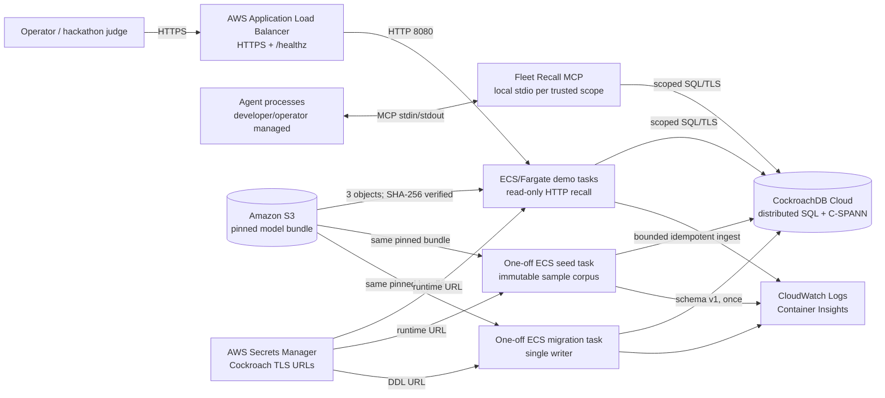
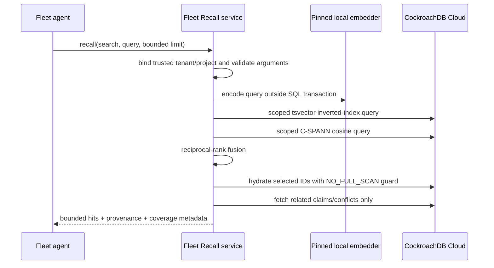
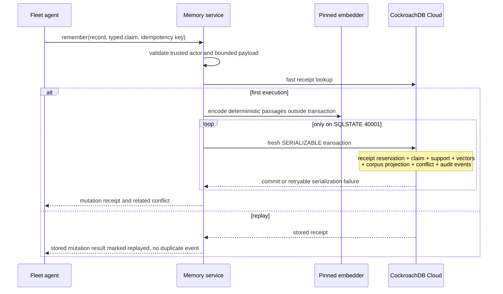

# Fleet Recall architecture

Fleet Recall adapts Recall's local-first memory semantics into a shared,
durable memory plane for a horizontally scaled OSTK agent fleet. The local
`ostk-recall` corpus remains the workstation default. `ostk-fleet-recall` is a
separate backend and deployment option for agents that must coordinate across
process, host, and availability-zone boundaries.

## Deployment topology

The checked-in Terraform provisions the HTTP demo, migration, and seed task
definitions. It does not provision an OSTK worker fleet or MCP sidecars. The
MCP path is exercised by separately bound local agent processes in the
LocalStack scenario and is ready to be embedded in future OSTK worker tasks;
that extension is not part of the hosted submission topology.

ECS containers are stateless. Replacing or scaling a task does not move memory:
the corpus, typed claims, idempotency receipts, conflict ledger, and events
remain in CockroachDB Cloud. A private S3 prefix supplies the same
content-addressed 512-dimensional model to every task, preventing embedding
drift between writers and readers. The schema reserves `memory_attention` for
a future agent/session focus feature; the current vertical slice neither reads
nor writes that table.

The public demo exposes a bounded recall request and health endpoint, not a
general mutation API. Fleet agents mutate memory over the local MCP process,
where trusted tenant/project/agent coordinates come from deployment rather than
caller-controlled JSON.

## Memory planes

| Plane | CockroachDB representation | Purpose |
|---|---|---|
| Active corpus | `memory_chunks` with scoped C-SPANN and inverted indexes | Hybrid semantic and lexical retrieval |
| Corpus history | `memory_chunk_history` | Retain stale/archive rows without polluting ANN candidates |
| Embedding registry | `memory_corpus_models` | One immutable active model identity per tenant/project |
| Claim ledger | `memory_claims`, support, embeddings, links, events | Correctable deliberate memory with provenance |
| Conflict ledger | `memory_conflicts`, members | Surface incompatible active typed claims rather than silently choosing one |
| Idempotent mutation receipts | `memory_mutation_receipts` | At most one committed mutation per tenant-wide key and identical canonical request |
| Fleet events | `memory_events` | Durable audit and future projection/CDC seam |
| Reserved attention (future) | `memory_attention` | Schema seam only; not read or written by the current vertical slice |

Active and historical chunks are physically separated. That is important for
CockroachDB's vector execution: the hot ANN table needs only equality-bound
tenant/project (and optional source) prefixes plus the vector order. Time range
and archive eligibility do not force an unbounded post-filter scan.

## Recall path

Dense project queries use `memory_chunks_semantic_idx`. Source-specific queries
use `memory_chunks_source_semantic_idx`. Typed claim passages have their own
model-prefixed vector index. Lexical candidates use
`memory_chunks_lexical_idx`; application-level reciprocal-rank fusion preserves
Recall's retrieval semantics.

## Deliberate-memory write path

Only `40001` triggers an automatic restart of the complete transaction with
exponential backoff. After an ambiguous transport or commit result, the service
does not blindly re-execute under a new identity: the caller retries the same
complete request with the same tenant-wide idempotency key. If the original
transaction committed, Fleet Recall returns its stored mutation result with
`idempotent_replay` set; otherwise the retry can become the first committed
execution. This is an at-most-one durable mutation guarantee, not exactly-once
response delivery. A changed request using the same key is rejected.

## Trust and isolation invariants

1. A process is configured for exactly one tenant/project. SQL predicates and
   primary keys lead with both fields, and repository methods re-validate them.
2. MCP request data cannot override tenant, project, agent, or privacy tier.
   Session is currently attribution metadata, not an authorization principal;
   future attention behavior must preserve that boundary.
3. The active corpus accepts exactly one model identity of dimension 512 per
   tenant/project. Model rotation requires an explicit evacuated/re-embedded
   corpus.
4. Ingest and MCP input/output sizes, result counts, claim passages, conflict
   members, and ANN post-filter candidates are bounded.
5. Conflicts are returned with coverage metadata. Truncation or value elision
   is explicit; a partial conflict view is never labeled complete.
6. Backend failures are logged server-side but database details are redacted
   from MCP clients.

## Scaling and failure behavior

- Each process owns a deliberately small SQLx pool. Capacity planning uses
  `maximum tasks × connections per task`, not the per-task number alone.
- C-SPANN prefix columns distribute and isolate fleet queries. UUID event IDs
  avoid a global append hotspot. Public claim IDs remain JavaScript-safe
  integers for compatibility; their sequences are a measured scaling risk and
  a candidate for hash-sharded indexes after contention testing.
- Embedding and S3 transfer occur before a transaction. A slow model never
  holds Cockroach intents.
- ECS can run two or more demo tasks across availability zones; ALB health
  checks and deployment circuit breaking replace unhealthy revisions.
- CockroachDB remains the source of truth when every application task is
  terminated. Service restart requires no cache reconstruction beyond loading
  the pinned model.
- The initial vector-index migration is non-transactional and deliberately run
  by one dormant-service migration task. Later schema changes are roll-forward
  operations monitored as CockroachDB schema-change jobs.

## Deliberate boundaries

- Fleet Recall does not replace local Recall. It consumes backend-neutral
  corpus interfaces extracted upstream and preserves the local-first product.
- The public HTTP surface is a demonstrator, not a multi-tenant control plane.
  Production tenant routing belongs behind authenticated workload identity and
  one trusted repository scope per request/task.
- Changefeeds, cross-region locality policy, WAF, private Cockroach connectivity,
  and bulk set-based ingestion are natural production extensions; none is
  required for correctness of the hackathon vertical slice.
