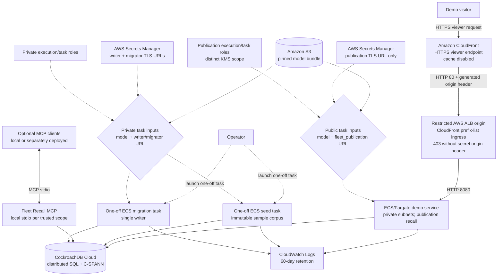
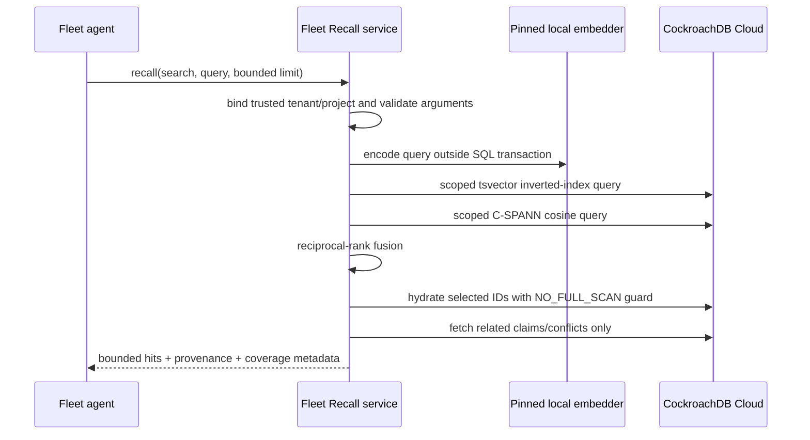
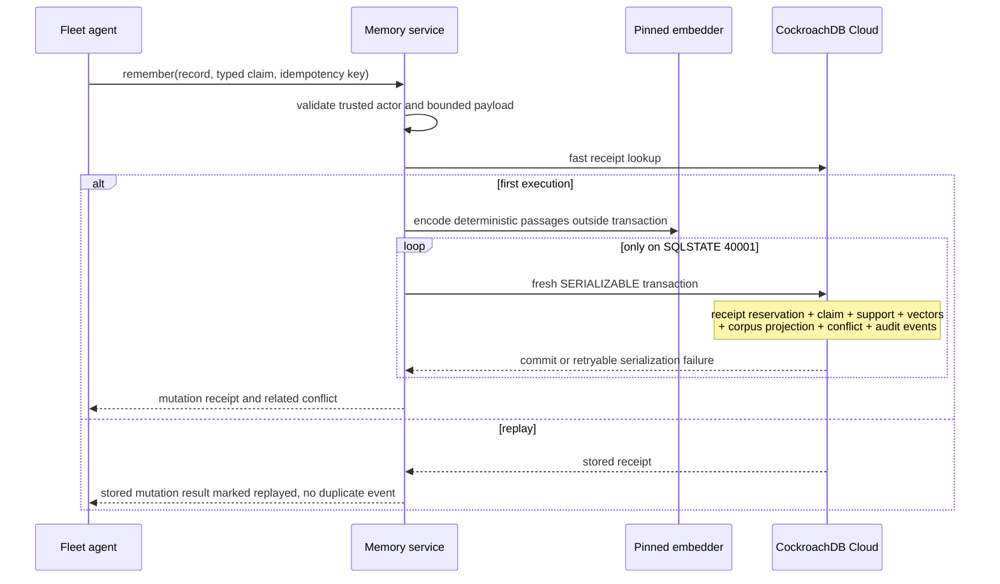

# Fleet Recall architecture

Fleet Recall adapts Recall's local-first memory semantics into a shared,
durable memory plane for horizontally scaled agent fleets, including OSTK.
The local `ostk-recall` corpus remains the workstation default.
`ostk-fleet-recall` is a separate backend and deployment option for agents
that must coordinate across process, host, and availability-zone boundaries;
using OSTK is optional.

This document describes the serving system: the MCP server, the read-only
HTTP demo, the CockroachDB schema they use, and the checked-in AWS topology,
including the bounded PUBLIC-03 database and task-input separation described
below. The broader event-driven corpus, provider-evidenced provenance graph,
separately graded causal hypotheses, runtime observation model, and private
control plane are specified in
[Dynamic corpus and causal runtime architecture](DYNAMIC_MEMORY_ARCHITECTURE.md).
Much of that design exists as library code with live database tests, but no
serving binary runs it yet; see the README's
[built but not yet wired](../README.md#built-but-not-yet-wired) section.

## Current checked-in topology

The public path is deliberately asymmetric. A demo visitor reaches CloudFront
over HTTPS. CloudFront then reaches the internet-facing ALB over HTTP port 80
and adds a Terraform-generated, 48-character origin header.
The ALB security group accepts port 80 only from AWS's managed CloudFront
origin-facing prefix list, and its default listener action returns `403` unless
that header matches. Accepted requests are forwarded over HTTP 8080 to the demo
service in private subnets. HTTPS therefore terminates at CloudFront; this path
is not described as TLS 1.2-minimum or end-to-end TLS.

The operator is separate from that visitor path and uses authenticated AWS
control-plane tooling to launch the one-off migration and seed tasks.

The diagram describes the checked-in Terraform. Its publication secret,
publication execution role, publication task role, and distinct
customer-managed KMS key scope pass `terraform validate` and the module's
Terraform tests but have not yet been applied to a live AWS stack.

The checked-in Terraform provisions the HTTP demo, migration, and seed task
definitions. The demo task receives only
`FLEET_RECALL_PUBLICATION_DATABASE_URL`; the migration and seed tasks use their
separate private credentials.

The MCP path is the product interface for arbitrary fleet clients. An optional
OSTK bridge can coordinate those clients, but Terraform does not provision OSTK
workers or MCP sidecars and the hosted demo does not depend on either one.

Private authority processes remain outside this topology. The workstation-only
successor CLI constructs the checked-in first-successor repository, and the
apply-only conflict-reconciliation CLI constructs its separate repository.
Neither binary is present in the production image or represented by an AWS
secret, IAM role, task definition, startup hook, MCP method, or HTTP route.
Successor activation and reconciliation each have a database-local one-shot
logical-role policy applied inside `fleet_recall` by a cluster admin only.
Both depend on a separate cross-database/PUBLIC-authority audit and an exclusive
temporary member window; database ownership alone is insufficient, and neither
policy is Terraform or runtime wiring.

ECS containers are stateless. Replacing or scaling a task does not move memory:
the corpus, typed claims, idempotency receipts, conflict ledger, and events
remain in CockroachDB Cloud. A private S3 prefix supplies the same
content-addressed 512-dimensional model to every task, preventing embedding
drift between writers and readers. The schema reserves `memory_attention` for
a future agent/session focus feature; the current serving path neither reads
nor writes that table.

The public demo exposes a bounded recall request and health endpoint, not a
general mutation API. Its configuration rejects every private writer, control,
activation, reconciliation, and test database variable. The fixed
`fleet_publication` login inherits only the `NOLOGIN`
`fleet_publication_reader` role: `CONNECT` on `fleet_recall`, `USAGE` on
`public`, and `SELECT` on exactly `_sqlx_migrations`, `memory_corpus_models`,
`memory_chunks`, `memory_claim_embeddings`, `memory_claim_support`,
`memory_claims`, `memory_conflict_members`, and `memory_conflicts`. No
sequence, DML, DDL, system, delegation, or private-table authority is granted.

Driver construction fixes the username, database, and
`ostk-fleet-recall-publication` application name. Every new connection and
every pool reuse re-witnesses those values and sets and verifies canonical
`search_path = pg_catalog, public, pg_temp` before application SQL runs.
Fleet clients mutate over MCP and the seed task writes through trusted ingest;
in both paths tenant/project/agent coordinates come from deployment rather
than caller-controlled JSON.

## Memory planes

| Plane | CockroachDB representation | Purpose |
|---|---|---|
| Active corpus | `memory_chunks` with scoped C-SPANN and inverted indexes | Hybrid semantic and lexical retrieval |
| Corpus history | `memory_chunk_history` | Retain stale/archive rows without polluting ANN candidates |
| Embedding registry | `memory_corpus_models` | One immutable active model identity per tenant/project |
| Claim ledger | `memory_claims`, support, embeddings, links, events | Correctable deliberate memory with provenance |
| Conflict ledger | `memory_conflicts`, members | Surface incompatible active typed claims rather than silently choosing one |
| Idempotent mutation receipts | `memory_mutation_receipts` | At most one committed mutation per tenant-wide key and identical canonical request |
| Fleet events | `memory_events` | Durable audit and future projection/CDC seam |
| Reserved attention (future) | `memory_attention` | Schema seam only; not read or written by the current serving path |
| General accepted-event ledger | `memory_evidence_events`, `memory_evidence_shard_heads` | Append-only general events under the control ledger's single log epoch; carries no governance kind |
| Ingress quarantine | `memory_evidence_quarantine` | Bounded integrity receipt for a rejected delivery: digest and diagnostic only, never payload bytes |
| Governed content store | `memory_content_objects` | Envelope-encrypted governed bytes addressed by storage identity and indexed for erasure |
| Relation projection | `memory_relation_projection_v1`, `memory_relation_projection_watermarks_v1` | Disposable current relation state with a per-`(ledger_family, shard)` cursor advanced in the same transaction |
| Writer authority witness | `memory_writer_authority_v1` (view) | Read-only bootstrap/epoch/registry-head projection; the writer's only authority read path |

Later migrations (19 through 28, see [`migrations/`](../migrations)) add
private-plane tables for the dynamic-memory runtimes: content-addressed body
projection, coverage cursors and receipts, the lexical/dense recall projection
and its visibility class, the transcript and CI connector state, normative
activation, the discrepancy ledger, and the bootstrap-manifest import rows.
The serving path does not read or write them yet; see
[Dynamic corpus and causal runtime architecture](DYNAMIC_MEMORY_ARCHITECTURE.md).
Migration 29 adds the one later table serving does use:
`memory_conflict_lifecycle_events_v1`, the append-only per-conflict lifecycle
log described under the write path below.

Serving accepts an uninterrupted successful migration prefix through at least
version 18, and later additive migrations remain compatible. The private
repositories retain their narrower, independently enforced compatibility
floors:

- Stage-2 control bootstrap requires successful prefix 1–3 and has a private
  workstation repository/CLI plus one-shot role.
- Genesis Stage-3 activation requires prefix 1–9 and has a private workstation
  repository/CLI plus one-shot role.
- The first-successor repository and workstation apply/inspect CLI require
  prefix 1–14 and have a database-local one-shot logical-role policy; no
  deployed login, production credential, or cloud/runtime wiring exists.
- Legacy conflict reconciliation requires prefix 1–16 and has an apply-only
  workstation CLI plus database-local one-shot role policy. Its cross-database
  authority audit remains external.
- Recall, remember, ingest, health, and the public demo require prefix 1–18.

Later additive rows cannot compensate for a missing or failed row inside a
required prefix. Migrations 15 through 17 do not add successor tables: they
version conflict uniqueness by detector and add the exact claim-transition and
current-conflict projection indexes. Migration 18 adds the Stage-4 runtime
foundations of [ADR 0002](adr/0002-stage4-runtime-foundations.md): the general
accepted-event ledger `memory_evidence_events` and its `memory_evidence_shard_heads`
-- which deliberately carries no foreign key to any control or registry table,
per the ADR's 2026-08-16 amendment, so the appender can seed a head without a
control-plane grant -- `memory_evidence_quarantine`,
`memory_content_objects`, the relation projection and its per-`(ledger_family,
shard)` watermark, the nullable `accepted_event_id` columns on `memory_claims`
and `memory_mutation_receipts`, and the read-only `memory_writer_authority_v1`
head-witness view. It grants the runtime role nothing on any `memory_control_*`
or `memory_registry_*` base table. Every object is created with `IF NOT
EXISTS` for resumability and then asserted against the committed public
catalog -- exact ordered column shape, the view's owner and definition, and the
complete committed constraint set of every new table (every CHECK, the primary
key, every UNIQUE, every foreign key) -- so a same-name object with another
shape, or with the D1 governance-exclusion CHECK missing, fails closed with
SQLSTATE `55000` instead of being adopted as a successful version 18.

The current conflict detector is the immutable contract
`same_key_functional_value_v2`. A conflict-eligible legacy claim key is the
normalized `subject::predicate` pair and is deliberately **functional** during
an overlapping half-open effective interval: it represents one exact typed
value, not an independently addable member of a multi-valued set. Two positive
claims conflict when their canonical values differ. A positive and a negative
claim conflict only when they name the same canonical value; two negative
claims do not conflict. Multi-valued facts must use one canonical collection
value or distinct predicates rather than relying on repeated scalar claims.
“Current” here means lifecycle state `active` or `disputed`; the detector checks
half-open interval overlap but does not independently expire claims against the
wall clock. This rule performs no corpus-wide natural-language inference.

Rows carrying the original `same_key_typed_value` detector retain their old
meaning and are reported as unreconciled legacy projections. The steady-state
v2 writer fails closed rather than appending to or relabelling them. The
implemented reconciliation repository locks one exact legacy ID/revision,
derives a bounded complete pair graph from current claims, preserves the legacy
row and memberships byte-for-byte, and appends a distinct
`same_key_functional_value_v2` lineage plus its receipt, audit event, and any
claim-state transitions in one serializable transaction. A no-conflict v2
projection is recorded as dismissed rather than rewriting or deleting legacy
history. The workstation CLI exposes only `apply`; identical retries use the
same bounded idempotency key and return the durable result.

Active and historical chunks are physically separated. That is important for
CockroachDB's vector execution: the hot ANN table needs only equality-bound
tenant/project (and optional source) prefixes plus the vector order. Time range
and archive eligibility do not force an unbounded post-filter scan.

## Recall path

Dense project queries use `memory_chunks_semantic_idx`. Source-specific queries
use `memory_chunks_source_semantic_idx`. Typed claim passages have their own
model-prefixed vector index. Lexical candidates use
`memory_chunks_lexical_idx`; application-level reciprocal-rank fusion preserves
Recall's retrieval semantics.

Every recorded claim is also projected into the corpus as a synthetic
`claim:{id}` chunk, and that row outlives the claim's lifecycle. On the private
writer, chunk search reads the current state of the claims behind the fused
synthetic hits and drops those that are no longer `active` or `disputed` before
projecting conflicts, reporting them in
`diagnostics.retrieval.lifecycle_hidden_claim_ids`. When dropped hits leave the
page short, retrieval runs again with a larger window, up to the 100-hit bound,
and a page still short there carries a `lifecycle_hidden_hits_underfilled`
warning. The publication reader is unchanged. Claim search already filters by
lifecycle state unless `include_history` is set.

When the writer serves the conflict lifecycle, every read that returns
conflicts (`search` of either kind, `get` of a claim or conflict, and
`conflicts`) attaches a `lifecycle` overlay after its main read transaction
has finished. The overlay is one separate autocommit statement against the
migration-29 lifecycle log, reading at most 33 newest events of each
conflict's episode (the current revision of an open conflict, the closed
episode's revision otherwise) through its covering episode index, and it
uses the database clock. A pure derivation turns those events into the
overlay's `state`, ADR 0003's `read_side`, the acknowledgers, and the closing
event. A failure of that read never fails the response: coverage reports
`lifecycle_overlay: unavailable` and the conflicts come back without it.
`get` with `kind=conflict` reads the log once more, oldest first and bounded
to 256 events, and derives `unlogged_transitions` from the revisions the
events do not cover, such as a reopen by `record`. The publication reader has
no grant on the log and never attaches the overlay.

## Deliberate-memory write path

Only `40001` triggers an automatic restart of the complete transaction with
exponential backoff. After an ambiguous transport or commit result, the service
does not blindly re-execute under a new identity: the caller retries the same
complete request with the same tenant-wide idempotency key. If the original
transaction committed, Fleet Recall returns its stored mutation result with
`idempotent_replay` set; otherwise the retry can become the first committed
execution. This is an at-most-one durable mutation guarantee, not exactly-once
response delivery. A changed request using the same key is rejected.

`remember(retract)` runs the same receipt protocol in its own serializable
transaction ([ADR 0004](adr/0004-serving-conflict-lifecycle.md)). A committed
receipt replays before any precondition is checked. The transaction then reads
the target claim and, for a conflict-eligible claim, takes locks in the record
path's order: first the key's conflict lineage rows, the same rows record's
detector probe locks through the `(tenant_id, project, claim_key, detector)`
index, then the key's lifecycle-current claims in ascending id order, bounded
at 256.
A claim that is not conflict-eligible is locked by primary key alone. Owner
authority (trusted actor, `operator_asserted` origin, `active` or `disputed`
state, and the expected revision) is checked against the locked row and
repeated in the `UPDATE`'s `WHERE` clause. When the key's v2 conflict is open,
the detector recomputes its incompatible pairs over the claims that remain
current, both in Rust and in SQL. If the two agree that no pair remains, the
conflict moves to `resolved` with the server-written reason kind
`no_current_incompatibility`, and each disputed member that no other open
conflict still holds returns to `active`. The key's preserved legacy row does
not hold it: once reconciliation gave the key a v2 lineage, that row is
history, as it already is for every current-facing read. Otherwise the
conflict stays open; if the two pair sets differ, nothing is closed and the
response reports `divergent`. Every transition writes a claim event, and the
call writes exactly one keyed `claim_retracted` event. A refusal is a typed
error returned from inside the transaction, so the receipt reservation rolls
back with everything else and the key stays free. Races between concurrent
lifecycle and record calls surface as `40001` and retry.

`remember(supersede)` combines the two paths in one serializable transaction.
Like record, it validates and embeds the successor before the transaction,
after a fast receipt lookup, so no model call holds a lock. Inside, after the
receipt, it reads the predecessor and refuses a successor whose kind,
normalized `subject::predicate` key, or conflict eligibility differs (a claim
is eligible when it has a key, a value, and an eligible kind), so a supersede
can never move a claim off its key or out of the detector's view. It then takes
the retract path's locks and owner checks and moves the predecessor to
`superseded`. The successor is written by the same helpers record uses: claim,
support, passage vectors, `claim:{id}` corpus chunk, the `recorded` claim
event, and conflict detection. Because the predecessor is no longer current,
the detector compares the successor only with the claims that stay current. It
may open, reopen, or join the key's v2 conflict. The predecessor's
`superseded_by` is then set to the successor, the successor gets an unkeyed
`claim_recorded` event that carries its detection audit and `supersedes`, and
the key's lineage and current claims are locked again and re-evaluated as for
a retract. A compatible successor therefore lets the conflict close and
restores its members, while an incompatible one keeps it open with the
successor as a member in its predecessor's place. The one keyed event is
`claim_superseded`, and the receipt names the successor. The record path's
SQL, statement order, and responses are unchanged by this sharing.

The conflict actions use the same receipt protocol and lock order and write
the append-only `memory_conflict_lifecycle_events_v1` table (migration 0029),
whose `event_seq` numbers each conflict's events from 1 without gaps; an event
is appended only while the conflict row is locked. `remember(acknowledge)`
reads the conflict, locks its key's lineage rows, requires the open v2
conflict at the caller's revision, and appends an `acknowledged` event for
that episode unless the agent already acknowledged it. It never updates
`memory_conflicts` or any claim. `remember(resolve)` also checks the member
count the caller read, because an open conflict gains members without a
revision change, then locks the key's current claims. It retracts only the
caller's own current member claims, exactly as a retract would, and asks the
detector (in Rust and in SQL) for the remaining incompatible pairs. None left
means the verified close: `resolved`, restored members, and a
detector-attributed `resolved` event. Any pair left, or a disagreement between
the two computations, refuses the request, so the retractions roll back with
everything else. With the lifecycle capability, retract and supersede closes
append the same detector-attributed event, with the caller's operation and key
and a cause payload. Each conflict action writes exactly one keyed
`memory_events` row and a receipt naming the conflict.

The writer serves these actions only after a startup probe: the schema must
have reached migration 29, and an `INSERT ... SELECT ... WHERE false` on the
log inside a rolled-back transaction must pass the privilege check. Without
it, the surface stays at `record|supersede|retract`, closes are audited in
`memory_events` only, and `MINIMUM_RECALL_SCHEMA_VERSION` stays 18, so every
binary runs on a schema without migration 29. The rollout is deploy the
binary, migrate, re-apply the runtime policy (its migration-29 gate and 49-row
grant matrix), then restart `serve`.

## Trust and isolation invariants

1. A process is configured for exactly one tenant/project. SQL predicates and
   primary keys lead with both fields, and repository methods re-validate them.
2. MCP request data cannot override tenant, project, agent, or privacy tier.
   Session is currently attribution metadata, not an authorization principal;
   future attention behavior must preserve that boundary.
3. The active corpus accepts exactly one model identity of dimension 512 per
   tenant/project. Model rotation requires an explicit evacuated/re-embedded
   corpus.
4. Ingest and MCP input/output sizes, result counts, claim passages, conflict
   members, and ANN post-filter candidates are bounded.
5. Conflicts are returned with coverage metadata. Truncation or value elision
   is explicit; a partial conflict view is never labeled complete.
6. Backend failures are logged server-side but database details are redacted
   from MCP clients.
7. Retirement is owner-only and resolution is detector-verified. An agent can
   retract, supersede, or concede (through `resolve`) only an
   `operator_asserted` claim it authored, and a successor keeps its
   predecessor's kind, key, and conflict eligibility. A supersede points its
   predecessor's `superseded_by` at that later successor, written by the same
   author. No request names a conflict outcome: a conflict closes only when
   the detector finds no incompatible lifecycle-current pair on its key, and a
   disputed claim is restored only when no other open conflict holds it. Every
   disputed claim therefore stays a member of at least one open current
   lineage (v2 when its key has one, otherwise legacy), and
   every open v2 conflict keeps at least one incompatible current pair.
   Acknowledgement changes only the lifecycle log. That log is append-only:
   each conflict's events are numbered without gaps, at most one close is
   logged per resulting revision, and every event belongs to a committed
   receipt. A refused lifecycle request rolls back completely and leaves no
   receipt.

## Scaling and failure behavior

- Each process owns a deliberately small SQLx pool. Capacity planning uses
  `maximum tasks × connections per task`, not the per-task number alone.
- C-SPANN prefix columns distribute and isolate fleet queries. UUID event IDs
  avoid a global append hotspot. Public claim IDs remain JavaScript-safe
  integers for compatibility; their sequences are a measured scaling risk and
  a candidate for hash-sharded indexes after contention testing.
- Embedding and S3 transfer occur before a transaction. A slow model never
  holds Cockroach intents.
- ECS can run two or more demo tasks across availability zones; ALB health
  checks and deployment circuit breaking replace unhealthy revisions.
- CockroachDB remains the source of truth when every application task is
  terminated. Service restart requires no cache reconstruction beyond loading
  the pinned model.
- The initial vector-index migration is non-transactional and deliberately run
  by one dormant-service migration task. Later schema changes are roll-forward
  operations monitored as CockroachDB schema-change jobs.

## Deliberate boundaries

- Fleet Recall does not replace local Recall. It consumes backend-neutral
  corpus interfaces extracted upstream and preserves the local-first product.
- The public HTTP surface is a demonstrator, not a multi-tenant control plane.
  Production tenant routing belongs behind authenticated workload identity and
  one trusted repository scope per request/task.
- Changefeeds, cross-region locality policy, WAF, private Cockroach connectivity,
  and bulk set-based ingestion are natural production extensions; none is
  required for correctness of the current serving path.

## Roadmap and open work

### Next product steps

- Implement the reserved Recall actions. The service contract already names
  `remember` forget, restore, resolve, relate, split, focus, track, and
  consolidate, and `recall` surface, discover, synthesize, and audit;
  today `remember(record|supersede|retract|acknowledge|resolve)` and
  `recall(search|get|conflicts|status)` are served (with `get` covering claims,
  chunks, and, on the private writer, conflicts; `acknowledge` and `resolve`
  need the migration-29 lifecycle log), and the others return an error.
  Adjudication (`dismiss` and `waive` by a non-implicated agent) is the next
  lifecycle step in [ADR 0004](adr/0004-serving-conflict-lifecycle.md), and
  `record` reopens are not logged yet; history reports them as unlogged
  transitions.
- Wire the dynamic-memory runtimes that already exist as library code into a
  worker or CLI and into MCP recall; the README's
  [built but not yet wired](../README.md#built-but-not-yet-wired) section lists
  what that needs.
- Package Fleet Recall as an optional OSTK Recall plugin/backend.
- Add authenticated workload identity and dynamic multi-project routing
  without trusting MCP parameters.
- Add set-based bounded ingestion, changefeed-driven projections, and
  multi-region locality policies.
- Add private AWS/CockroachDB connectivity, WAF/rate limiting, operational
  SLOs, and contention/hot-range alerts.

### Acceptance scenarios

These are the behaviors the serving path is built to preserve:

1. An agent in project A cannot retrieve project B's or another tenant's rows,
   even when it injects scope-like values into MCP arguments.
2. Agent A records a typed decision with an idempotency key; replay returns the
   original receipt and creates no duplicate claim or event.
3. Agent B semantically recalls the decision through vector plus lexical RRF
   and records a changed rollout plan based on that memory.
4. Agent C records an overlapping, incompatible typed value; both claims become
   disputed and an explainable conflict is surfaced. Agent B pauses the rollout
   and records an operator escalation.
5. A serving task can be terminated and replaced without losing durable memory.
6. Representative dense, source-prefixed dense, and lexical queries select both
   scoped vector indexes and the lexical inverted index.
7. A semantic source search resolves exact hash-bound claim support, surfaces
   the relevant documentation and implementation chunks, and projects their
   exact open conflict without corpus-wide natural-language inference.

### Known technical debt

1. **JavaScript-safe numeric claim IDs are sequential.** Recall's public claim
   contract uses numeric IDs, so Fleet Recall caps sequences at `2^53-1`
   instead of replacing them with UUIDs. Composite tenant/project prefixes
   distribute different fleets, but one very hot project may still concentrate
   writes. Before production scale, run contention tests and add hash-sharded
   lookup indexes or version the public ID contract.
2. **Trusted NDJSON ingestion upserts rows individually.** Each write stays
   small and independently retryable, but network efficiency is left on the
   table. Batch bounded rows via `UNNEST`/set-based SQL without combining
   embedding work with transactions.
3. **The public demo has broad outbound network egress.** Terraform narrows
   inbound traffic and IAM resources, but a production VPC should use AWS
   service endpoints/prefix lists and private CockroachDB connectivity.
4. **Operational monitoring is scaffolded, not baselined.** CloudWatch
   application logs are enabled and Terraform supports optional ECS Container
   Insights, but retry-rate, p99 latency, long-transaction, contention, and
   hot-range alert thresholds still need to be measured under representative
   load.
