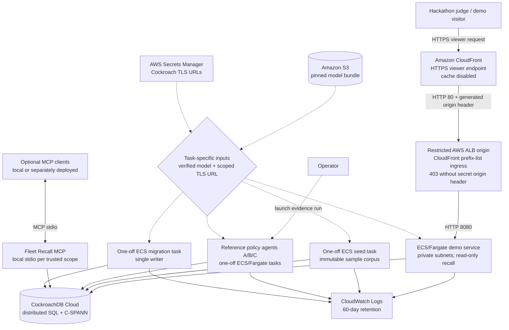
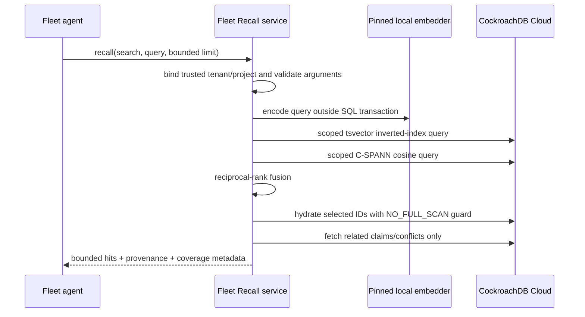
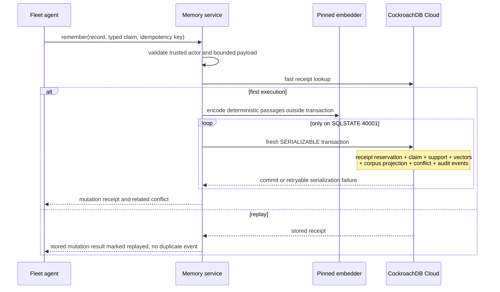

# Fleet Recall architecture

Fleet Recall adapts Recall's local-first memory semantics into a shared,
durable memory plane for horizontally scaled agent fleets, including OSTK.
The local `ostk-recall` corpus remains the workstation default.
`ostk-fleet-recall` is a separate backend and deployment option for agents
that must coordinate across process, host, and availability-zone boundaries;
using OSTK is optional.

This document describes the implemented hackathon system. The proposed
event-driven corpus, provider-evidenced provenance graph, separately graded
causal hypotheses, runtime observation model, and permanently separated
public/private planes are specified in
[Dynamic corpus and causal runtime architecture](DYNAMIC_MEMORY_ARCHITECTURE.md);
they are not claims about the current deployment.

## Deployment topology

The public path is deliberately asymmetric. A hackathon judge or demo visitor
reaches CloudFront over HTTPS. CloudFront then reaches the internet-facing ALB
over HTTP port 80 and adds a Terraform-generated, 48-character origin header.
The ALB security group accepts port 80 only from AWS's managed CloudFront
origin-facing prefix list, and its default listener action returns `403` unless
that header matches. Accepted requests are forwarded over HTTP 8080 to the demo
service in private subnets. HTTPS therefore terminates at CloudFront; this path
is not described as TLS 1.2-minimum or end-to-end TLS.

The operator is separate from that visitor path and uses authenticated AWS
control-plane tooling to launch the one-off reference-policy evidence run.

The checked-in Terraform provisions the HTTP demo, migration, seed, and
reference-policy-agent task definitions. The evidence wrapper starts four
independent Fargate tasks bound to agents A, B, C, and B: they record a
decision, retrieve it through lexical+dense RRF, persist a cited rollout
action, surface an incompatible decision, and persist a cited escalation. Each
task receives only its trusted identity and run coordinate; CockroachDB is the
durable handoff between processes. The policy is deliberately fixed and
fail-closed, so this proof needs neither an LLM nor OSTK.

The MCP path remains the product interface for arbitrary fleet clients and is
exercised by separately bound local processes in the deterministic LocalStack
scenario. An optional OSTK bridge can coordinate those clients, but Terraform
does not provision OSTK workers or MCP sidecars and the hosted submission does
not depend on either one.

Private authority processes remain outside this topology. The workstation-only
successor CLI constructs the checked-in first-successor repository, and the
apply-only conflict-reconciliation CLI constructs its separate repository.
Neither binary is present in the production image or represented by an AWS
secret, IAM role, task definition, startup hook, MCP method, or HTTP route.
Successor activation and reconciliation each have a database-local one-shot
logical-role policy applied inside `fleet_recall` by a cluster admin only.
Both depend on a separate cross-database/PUBLIC-authority audit and an exclusive
temporary member window; database ownership alone is insufficient, and neither
policy is Terraform or runtime wiring.

ECS containers are stateless. Replacing or scaling a task does not move memory:
the corpus, typed claims, idempotency receipts, conflict ledger, and events
remain in CockroachDB Cloud. A private S3 prefix supplies the same
content-addressed 512-dimensional model to every task, preventing embedding
drift between writers and readers. The schema reserves `memory_attention` for
a future agent/session focus feature; the current vertical slice neither reads
nor writes that table.

The public demo exposes a bounded recall request and health endpoint, not a
general mutation API. Reference agents mutate through the same trusted service
facade inside one-off tasks; general fleet clients mutate over MCP. In both
paths tenant/project/agent coordinates come from deployment rather than
caller-controlled JSON.

The reference policy never executes recalled text. It accepts only one exact,
typed migration decision from agent A, re-reads the selected claim by numeric
ID, and emits one allowlisted action with the source claim ID attached. Agent C
then records the deliberately incompatible value; the final agent-B task
requires the exact two-member disputed conflict before it records a cited
pause-and-escalate action. Any missing lane, actor, value, state, member, or
citation fails the task closed.

## Memory planes

| Plane | CockroachDB representation | Purpose |
|---|---|---|
| Active corpus | `memory_chunks` with scoped C-SPANN and inverted indexes | Hybrid semantic and lexical retrieval |
| Corpus history | `memory_chunk_history` | Retain stale/archive rows without polluting ANN candidates |
| Embedding registry | `memory_corpus_models` | One immutable active model identity per tenant/project |
| Claim ledger | `memory_claims`, support, embeddings, links, events | Correctable deliberate memory with provenance |
| Conflict ledger | `memory_conflicts`, members | Surface incompatible active typed claims rather than silently choosing one |
| Idempotent mutation receipts | `memory_mutation_receipts` | At most one committed mutation per tenant-wide key and identical canonical request |
| Fleet events | `memory_events` | Durable audit and future projection/CDC seam |
| Reserved attention (future) | `memory_attention` | Schema seam only; not read or written by the current vertical slice |

Current release completion requires exactly the seventeen successful migration
rows 1 through 17. Serving accepts an uninterrupted successful prefix of at
least 17, including later additive migrations. The private repositories retain
their narrower, independently enforced compatibility floors:

- Stage-2 control bootstrap requires successful prefix 1–3 and has a private
  workstation repository/CLI plus one-shot role.
- Genesis Stage-3 activation requires prefix 1–9 and has a private workstation
  repository/CLI plus one-shot role.
- The first-successor repository and workstation apply/inspect CLI require
  prefix 1–14 and have a database-local one-shot logical-role policy; no
  deployed login, production credential, or cloud/runtime wiring exists.
- Legacy conflict reconciliation requires prefix 1–16 and has an apply-only
  workstation CLI plus database-local one-shot role policy. Its cross-database
  authority audit remains external.
- Recall, remember, ingest, health, and the public demo require prefix 1–17 as
  the normal runtime/serving release surface.

Later additive rows cannot compensate for a missing or failed row inside a
required prefix. Migrations 15 through 17 do not add successor tables: they
version conflict uniqueness by detector and add the exact claim-transition and
current-conflict projection indexes.

The current conflict detector is the immutable contract
`same_key_functional_value_v2`. A conflict-eligible legacy claim key is the
normalized `subject::predicate` pair and is deliberately **functional** during
an overlapping half-open effective interval: it represents one exact typed
value, not an independently addable member of a multi-valued set. Two positive
claims conflict when their canonical values differ. A positive and a negative
claim conflict only when they name the same canonical value; two negative
claims do not conflict. Multi-valued facts must use one canonical collection
value or distinct predicates rather than relying on repeated scalar claims.
“Current” here means lifecycle state `active` or `disputed`; the detector checks
half-open interval overlap but does not independently expire claims against the
wall clock. This rule performs no corpus-wide natural-language inference.

Rows carrying the original `same_key_typed_value` detector retain their old
meaning and are reported as unreconciled legacy projections. The steady-state
v2 writer fails closed rather than appending to or relabelling them. The
implemented reconciliation repository locks one exact legacy ID/revision,
derives a bounded complete pair graph from current claims, preserves the legacy
row and memberships byte-for-byte, and appends a distinct
`same_key_functional_value_v2` lineage plus its receipt, audit event, and any
claim-state transitions in one serializable transaction. A no-conflict v2
projection is recorded as dismissed rather than rewriting or deleting legacy
history. The workstation CLI exposes only `apply`; identical retries use the
same bounded idempotency key and return the durable result.

Active and historical chunks are physically separated. That is important for
CockroachDB's vector execution: the hot ANN table needs only equality-bound
tenant/project (and optional source) prefixes plus the vector order. Time range
and archive eligibility do not force an unbounded post-filter scan.

## Recall path

Dense project queries use `memory_chunks_semantic_idx`. Source-specific queries
use `memory_chunks_source_semantic_idx`. Typed claim passages have their own
model-prefixed vector index. Lexical candidates use
`memory_chunks_lexical_idx`; application-level reciprocal-rank fusion preserves
Recall's retrieval semantics.

## Deliberate-memory write path

Only `40001` triggers an automatic restart of the complete transaction with
exponential backoff. After an ambiguous transport or commit result, the service
does not blindly re-execute under a new identity: the caller retries the same
complete request with the same tenant-wide idempotency key. If the original
transaction committed, Fleet Recall returns its stored mutation result with
`idempotent_replay` set; otherwise the retry can become the first committed
execution. This is an at-most-one durable mutation guarantee, not exactly-once
response delivery. A changed request using the same key is rejected.

## Trust and isolation invariants

1. A process is configured for exactly one tenant/project. SQL predicates and
   primary keys lead with both fields, and repository methods re-validate them.
2. MCP request data cannot override tenant, project, agent, or privacy tier.
   Session is currently attribution metadata, not an authorization principal;
   future attention behavior must preserve that boundary.
3. The active corpus accepts exactly one model identity of dimension 512 per
   tenant/project. Model rotation requires an explicit evacuated/re-embedded
   corpus.
4. Ingest and MCP input/output sizes, result counts, claim passages, conflict
   members, and ANN post-filter candidates are bounded.
5. Conflicts are returned with coverage metadata. Truncation or value elision
   is explicit; a partial conflict view is never labeled complete.
6. Backend failures are logged server-side but database details are redacted
   from MCP clients.

## Scaling and failure behavior

- Each process owns a deliberately small SQLx pool. Capacity planning uses
  `maximum tasks × connections per task`, not the per-task number alone.
- C-SPANN prefix columns distribute and isolate fleet queries. UUID event IDs
  avoid a global append hotspot. Public claim IDs remain JavaScript-safe
  integers for compatibility; their sequences are a measured scaling risk and
  a candidate for hash-sharded indexes after contention testing.
- Embedding and S3 transfer occur before a transaction. A slow model never
  holds Cockroach intents.
- ECS can run two or more demo tasks across availability zones; ALB health
  checks and deployment circuit breaking replace unhealthy revisions.
- CockroachDB remains the source of truth when every application task is
  terminated. Service restart requires no cache reconstruction beyond loading
  the pinned model.
- The initial vector-index migration is non-transactional and deliberately run
  by one dormant-service migration task. Later schema changes are roll-forward
  operations monitored as CockroachDB schema-change jobs.

## Deliberate boundaries

- Fleet Recall does not replace local Recall. It consumes backend-neutral
  corpus interfaces extracted upstream and preserves the local-first product.
- The public HTTP surface is a demonstrator, not a multi-tenant control plane.
  Production tenant routing belongs behind authenticated workload identity and
  one trusted repository scope per request/task.
- Changefeeds, cross-region locality policy, WAF, private Cockroach connectivity,
  and bulk set-based ingestion are natural production extensions; none is
  required for correctness of the hackathon vertical slice.
