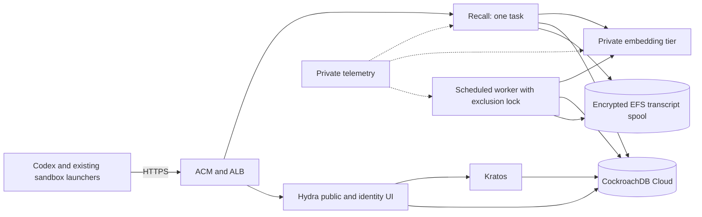

# M4: dependable remote access for daily Codex use

Status: implementation in progress, 2026-09-27. M4.1 is implemented. M4.2's
single-Mac HTTPS services, native Codex CLI and container paths are deployed
and tested; browser trust, desktop restart and a second-machine LAN/VPN check
remain unqualified. M4.3–M4.5 remain pending. The original baseline was
`ea6d43d` on `main`, including M3 and merged Prometheus/Grafana telemetry.
The original remote plan ended at M3. M4 is the follow-on described here.

## M4.1 checkpoint

The shared implementation adds bounded CA bundles to shim, shipper, and
launcher; read-only sandbox trust mounts and retained cleanup trust; explicit
HTTP development opt-in; human authorization-server and scope metadata
configuration; and grant lifetime/startup checks. The matching sandbox image
checks an absolute grant-derived last-start time before invoking a provider,
including after Kubernetes scheduling delays. Existing launch state remains
readable for teardown. See [client instructions](REMOTE_PLANE.md) and
[local/cloud profile examples](../deploy/remote/profiles/README.md).

Automated coverage includes real TLS trust/hostname/expiry/rotation checks,
shim and transcript transport, grant mint/revoke and failed-launch cleanup,
metadata boundaries, sandbox credential isolation, and delayed-start refusal.
At that checkpoint, actual image mounts, native Codex OAuth refresh, canonical
DNS/edge routing, and the second-machine journey still required M4.2/release
qualification. The M4.1 implementation alone did not upgrade the M3 deployment.

Validation on Rust 1.94: locked build, strict all-target Clippy, formatting,
and the standard suite (2,789 passed, 19 ignored); 10 Python sandbox/TLS tests,
CLI transport checks, local manifest rendering, and `cargo deny check` passed.
Database-gated tests had no connected database, so this is not new live-SQL
evidence. UBS's staged-file scan remained partial because its shadow workspace
lacks unchanged Rust modules; changed-path findings were reviewed, and the
existing dependency exceptions remain documented in [SECURITY.md](SECURITY.md).

## M4.2 local deployment checkpoint

The existing Lima/k0s installation now serves the canonical Recall, Hydra and
login names over verified HTTPS. The cutover retained the database, existing
enrolled subject, generation-3 authority, signing/cookie keys, content key and
transcript spool. Gateway access to private application Secrets is denied;
public routes exclude administrative APIs. Old Recall/Ory NodePorts are closed.
The worker's original schedule has been restored after authenticated acceptance.

Live checks passed for secure browser-form login/consent/CSRF and Kratos logout,
old-issuer rejection, native Codex OAuth and refresh after token expiry, Docker
and Kubernetes shim/grant/shipping flows, and a real Codex sandbox transcript
round trip into searchable evidence. Network denial was tested from an unrelated
pod against the same ready sockets that allowed control pods reached before and
after the denial test. Wrong trust and unknown TLS names were rejected.

See the [operator runbook](../deploy/local/https/README.md) and
[qualification record](../deploy/local/https/QUALIFICATION.md). This checkpoint
does not close the entire M4.2 acceptance row: macOS browser trust awaits user
authorization, the current Codex desktop process needs restart qualification,
and LAN/VPN exposure needs a selected stable address and a second machine.
Cloud deployment and lifecycle/restore rehearsals remain later milestones.

## Outcome and scope

A clean Codex installation on another machine can authenticate to a stable
HTTPS endpoint, record and recall memory, launch an existing Docker or
Kubernetes sandbox, and recall that sandbox's shipped transcript with source
provenance. The same checks pass against a local LAN/VPN deployment and a
cloud deployment. Restarting services preserves identities, grants, content,
and transcripts. An operator can observe failures and restore the deployment.

Implement the common identity/TLS contract first, prove it locally, then
deploy the cloud profile. Use AWS as the cloud planning assumption because
the repository already contains AWS Terraform; the hostname, authentication,
storage, and acceptance contracts remain portable.

M4 includes deployment automation, operational checks, and the small runtime
changes required to meet this outcome. It does not include a Fargate or
Firecracker sandbox launcher, an S3 transcript backend, a Pulumi rewrite,
automatic closed-session retirement, multi-region operation, or horizontal
scaling of the transcript receiver. Claude support remains in the images and
compatibility tests; a live Claude model run can be qualified separately while
usage credits are unavailable. Codex is the required live harness for M4.
LocalStack remains optional and disabled in the reference profiles.

The frozen generation-3 writer authority and migration prefix 39 remain the
baseline. No database migration is planned. Any implementation finding that
requires a migration must explicitly revise this plan and all affected exact
role-policy gates before that work lands.

## What M3 already provides, and what M4 must change

| Area | Verified baseline | M4 work |
|---|---|---|
| Remote service | HTTP MCP, registry authorization, scoped/revocable grants | Stable HTTPS resource and issuer URLs; usable human OAuth discovery |
| Identity | Hydra/Kratos on loopback URLs with development cookies | Production URL/cookie/proxy settings; controlled account provisioning |
| Clients | Native Codex HTTP MCP; Rust stdio shim; Docker/Kubernetes launcher | Complete custom-CA support and explicit HTTP development opt-in |
| Transcripts | Bounded POSIX spool, offset replay, worker ingestion, Codex/Claude parsers | Durable deployment storage, restart/replay proof, backup/restore |
| Model | Private pinned embedding tier; lexical degradation verified | Private discovery/routing and deployment health checks |
| Local platform | Lima/k0s, hostPath storage, loopback forwards | HTTPS gateway, DNS/trust profiles, explicit LAN/VPN reachability |
| AWS platform | Public read-only demo on ECS/Fargate | Add a separate private-memory remote stack; preserve demo isolation |
| Telemetry | Structured logs, private metrics, six Grafana dashboards | Edge/TLS checks, readiness, worker freshness, cloud collection and alerts |

Important code gaps found during planning:

- `src/shim.rs` and the launcher's `GrantClient` have no custom-CA option.
  The shipper has one, but the launcher does not distribute it to the sandbox.
  Installing a root in the Mac browser alone is insufficient for these clients.
- Protected-resource metadata currently advertises all configured OIDC
  anchors, including the internal Kubernetes issuer. Split advertised human
  authorization servers from the full verification-anchor set. Validate the
  advertised list against configured anchors. RFC 9728 permits an advertised
  subset. [Protected-resource metadata](https://www.rfc-editor.org/rfc/rfc9728.html#section-2)
- `/healthz` is listener health and currently serves as readiness too. Add a
  separate readiness contract; do not mark a database-disconnected instance
  ready merely because it can answer HTTP.
- The local sandbox shim wrapper automatically enables HTTP based on the URL.
  Make this an explicit development-profile option that is absent from HTTPS
  profiles, including the launcher and generated sandbox configuration.
- The local worker is a non-overlapping Kubernetes CronJob. ECS needs an
  equivalent exclusion mechanism; a periodic schedule alone does not supply it.
- A sandbox may run for the whole default grant lifetime, leaving no margin
  for startup or final shipping. Validate remaining grant lifetime against the
  bounded execution timeout plus measured startup/flush margins before launch.
  All-day delegated sandboxes would require a separate renewal design; daily
  workstation use goes through native Codex OAuth and its refresh lifecycle.

## One address and identity contract, three deployment profiles

The names below are examples, not allocated DNS names. Choose final names
before OAuth enrollment or issuing durable launch state. Use separate local
and cloud identities, keys, databases/scopes, and client registrations.

| Property | Local, single Mac | Local, LAN/VPN | AWS cloud |
|---|---|---|---|
| Recall URL | `https://recall.fleet.test:8443/mcp` | Same URL as single-Mac profile | `https://recall.<owned-zone>/mcp` |
| Human issuer | `https://auth.fleet.test:8443/` | Same issuer | `https://auth.<owned-zone>/` |
| Login/identity origin | `https://login.fleet.test:8443` | Same origin | `https://login.<owned-zone>` |
| Reachability | Mac plus explicitly configured containers/pods | Dedicated Mac LAN/VPN address; trusted clients only | ACM HTTPS ALB; private service targets |
| Certificate | Development CA | Development CA with explicit trust distribution, or DNS-01 public certificate using an owned zone | Publicly trusted ACM certificate |
| Persistent state | Existing secure local CockroachDB and Lima disk | Same local state | CockroachDB Cloud plus encrypted EFS spool |
| Sandbox execution | Existing Docker/Kubernetes backends | Same backends from an authorized launcher | Existing launchers can run outside AWS and call the cloud plane |

The `.test` examples are only for the private-CA profiles. Public DNS-01 mode
uses names in an owned DNS zone in both local profiles, selected before
enrollment; switching between those name sets later requires the identity
cutover below.

Use the same exact resource and issuer strings from every network. DNS may
resolve those names differently inside Kubernetes, on the Mac, and over a
VPN; TLS names, JWT `iss`/`aud`, discovery documents, and OAuth requests must
remain identical. Do not rewrite token claims or substitute internal service
URLs into public metadata. Remove `FLEET_RECALL_OIDC_LOCAL_TRANSPORTS` from
the HTTPS profiles after direct canonical-name discovery succeeds.

Keep machine anchors separate: local Kubernetes service-account discovery
remains private and authenticated. Do not advertise it as a human login
server. The AWS baseline uses enrolled local-key launchers, which M3 already
implements. The server's AWS identity exchange does not imply that the
launcher CLI has an AWS-IAM mode; adding that mode is outside this milestone.
Human Codex OAuth also does not provision a launcher credential. Include fresh
workstation key generation, private storage, workstation-only enrollment,
recovery, and revocation instructions for local-key launchers. Alternatively,
the journey can use an explicitly identified, already-enrolled launcher host;
it must not silently borrow another operator's credential.

The existing Hydra audience exception remains explicit:
`scope_substitute:fleet-recall` is permitted only for an empty audience at
that configured anchor; a nonempty wrong audience still fails. HTTPS does
not add RFC 8707 support to Hydra. Removing this exception requires a separate
issuer compatibility decision and tests, not a silent M4 configuration edit.

## Local deployment design

Add an HTTPS overlay that composes the existing remote-plane overlay. Pin a
Traefik release and its supported Gateway API CRDs during implementation;
record the exact chart/image versions after testing with the installed k0s
version. The existing workload named `ingress` is a webhook service, not an
edge controller. No edge controller or load-balancer implementation is
currently installed. Gateway API is the preferred new routing API; avoid
starting on the retired ingress-nginx controller.
[Kubernetes Gateway API](https://kubernetes.io/docs/concepts/services-networking/gateway/),
[ingress-nginx retirement](https://kubernetes.io/blog/2026/03/30/kubernetes-v1-36-sneak-peek/)

Use one TLS entrypoint on port 8443, exposed through a dedicated NodePort
(proposed 30443). A Lima forward maps that port to Mac port 8443. In the
single-Mac profile it remains loopback-bound. The LAN/VPN profile explicitly
binds a stable selected host interface and limits incoming clients with the
host/network firewall. Do not change every existing forward to `0.0.0.0`.
Port 443 can be an optional profile after verifying its binding and routing
on the installed Lima/macOS version; 8443 avoids making that a prerequisite.

Reconcile the running Lima configuration with the committed template without
recreating the VM or its disks. Add explicit Recall/Ory NetworkPolicies:
gateway to public services, UI to the required identity admin APIs, Recall and
worker to database/embed/discovery, and private telemetry collection. Preserve
the existing webhook/publication flows. Prove both intended connectivity and
denial from unrelated pods; edge routing alone does not isolate the cluster.

Document and test name resolution from four locations: Mac, Docker sandbox,
k0s pod, and second machine. Loopback addresses only work within their own
network namespace. In the LAN profile, clients resolve the names to the
Mac's stable LAN/VPN address; pods can use split DNS pointing the same names
to the gateway ClusterIP, whose service also listens on 8443. For single-Mac
Docker access, configure the tested host-gateway route without changing the
canonical hostname. A hosts-file entry on the Mac alone is not a completed
DNS setup. Renewed addresses or a disconnected VPN must fail diagnostics
clearly rather than silently fall back to HTTP.

Provide two certificate modes:

1. Reproducible development CA, with a separately stored root private key and
   an intermediate CA certificate/signing key in a restricted Kubernetes
   Secret. Keep the root key outside the cluster. Automate leaf issuance/renewal with a
   pinned cert-manager version. Distribute only the public CA bundle to
   clients, Recall's OIDC verifier, and sandbox containers.
2. Optional public certificate via DNS-01 for an owned domain that resolves
   to private addresses. Scope the DNS credential to the challenge zone.
   This simplifies daily client trust, but is not required for the offline
   local setup. [cert-manager DNS-01](https://cert-manager.io/docs/configuration/acme/dns01/)

Codex documents `CODEX_CA_CERTIFICATE`, falling back to `SSL_CERT_FILE`, for
its HTTPS clients. Verify both MCP traffic and its OAuth exchange with the
installed CLI/app-server version. Document how the desktop process receives
the bundle; a shell export does not prove an already-running app inherited it.
Keep provider authentication working when the local CA is added.
[Codex custom CA bundles](https://learn.chatgpt.com/docs/auth#custom-ca-bundles)

The CA implementation should accept a bounded PEM bundle so overlapping
roots can be staged for rotation. Wire it through shim, grant mint/revoke,
shipper, Docker/Kubernetes mounts, and launcher state needed for `launch down`.
Keep existing launch-state files readable for cleanup after the new fields land.
Keep the server OIDC-discovery CA and the client resource-server CA separately
configurable; they need not share a trust root. CA reload may initially be a
documented controlled restart. No certificate-verification bypass is allowed.

Local durability remains limited by the single Lima VM/disk. Preserve it
across ordinary redeployments, and export encrypted backups off that disk.
A VM restart check proves restart recovery; it does not prove disaster recovery.
Document VM autostart and Mac sleep behavior: a sleeping or disconnected Mac
cannot provide an always-available remote service.

## Edge routes and Ory configuration

| Reachability | Routes/services |
|---|---|
| Client HTTPS | Recall `/mcp`, protected-resource metadata, grant mint/revoke, transcript offset/upload, and any explicitly enabled identity-exchange route |
| Client HTTPS | Hydra public discovery/JWKS, authorization/token/revocation/logout, and public client registration if enabled |
| Client HTTPS | Login/consent UI and the Kratos browser-flow endpoints required by that UI |
| Private only | Hydra/Kratos administration, SQL, embedding tier, Kubernetes API, metrics, health/readiness probes, Prometheus, Grafana, enrollment and authority ceremonies |

Prefer a single login origin for UI and browser-facing Kratos endpoints,
with an explicit path-routing table. Prove cookie paths, redirect locations,
CSRF, logout, and recovery/settings routes supported by the pinned UI before
finalizing that table. Do not assume a `/kratos/` prefix works without matching
base-URL/rewrite support. If separate identity origins are necessary, document
the narrower cookie-domain and CORS settings and run the same browser tests.

Disable Hydra/Kratos development modes and the UI's insecure-CSRF-cookie
override. Set canonical public/base/issuer/login/consent/logout/return URLs,
secure cookie settings, exact allowed origins/returns, and persistent Ory
system/cookie/cipher secrets. Replace the local-only subject salt with an
environment secret where applicable. Trust forwarded scheme/host information
only from the configured edge. Preserve the external host and intended path.
Ory recommends TLS termination at an edge and keeping its administration
interfaces private. [Ory production guidance](https://www.ory.com/docs/hydra/self-hosted/production)

Cloud identity provisioning defaults to operator-managed accounts; explicitly
disable public self-registration and unused recovery/verification flows until
their mail delivery and policies are configured. Keep a documented private
administrative recovery path. Prefer preregistered public OAuth clients for a
small controlled deployment; optionally enable Hydra's public DCR endpoint
with abuse limits. Never expose the general admin client-management API to
make DCR work. OAuth client registration itself confers no Recall permissions:
principal enrollment is still required.

For Codex, register the exact callback reported for the final server URL.
Its callback can depend on server URL and issuer metadata; do not assume the
old localhost registration survives. Include loopback variable-port behavior,
PKCE, `iss` validation, refresh, and logout in the client test. Keep the existing
Claude preregistration compatibility path.
[Codex MCP OAuth configuration](https://learn.chatgpt.com/docs/extend/mcp#streamable-http-servers)

Verify requested scopes and refresh-token issuance without logging token
values: current protected-resource metadata advertises only `fleet-recall`,
so Hydra's `offline_access` defaults alone do not prove client refresh. Make
any necessary advertised-scope configuration part of M4.1. Qualification must
include a real MCP call after the access token expires (currently one hour),
followed by another after restarting Codex.

Pass `Authorization`, MCP protocol/method/name headers, `WWW-Authenticate`,
OAuth query/form parameters, and transcript GET/PUT bodies unmodified. Do not
cache authenticated responses or add a browser-login redirect in front of
MCP. Configure edge body limits and timeouts against application bounds,
including the current 4 MiB transcript window; exercise maximum permitted
uploads and slow requests. Redirecting an ordinary
browser from HTTP may be optional, but authenticated clients must begin on
HTTPS and reject unsafe redirects themselves.

M4's baseline provides verified TLS to the edge and network-isolated private
service hops. Database connections retain `verify-full`; EFS uses encrypted
transport. Verified TLS on every internal application hop is a separate
deployment requirement if the chosen environment needs it. An ALB HTTPS
target group alone does not authenticate backend certificates.
[ALB target TLS behavior](https://docs.aws.amazon.com/elasticloadbalancing/latest/application/load-balancer-target-groups.html)

## AWS deployment design

Create an additive `deploy/aws/remote/` Terraform root with its own state,
tests, example variables, migration/deployment helpers, and runbook. Reuse
reviewed VPC/network outputs, ECR image conventions, strict Secrets Manager ARN
handling, and CockroachDB Cloud connectivity from `deploy/aws/`. Keep the
existing publication demo and its SQL/IAM/public-route boundaries intact.
Do not turn its `demo` command into `serve` or reuse its CloudFront policy:
that policy does not forward the authentication traffic M4 requires.

Use an ACM HTTPS ALB with host/path rules and private ECS/Fargate services
for Recall, embed, Hydra, Kratos, and the identity UI. Deny unknown hosts and
unlisted routes. Security groups permit only required edge-to-service and
service-to-service traffic. Give tasks no public IPs; account for outbound
ECR, model S3, Secrets Manager, logs, and database connectivity through the
selected endpoints/NAT design. The current network stack's single NAT gateway
is a documented availability tradeoff, not multi-AZ egress resilience.
[ALB HTTPS listeners](https://docs.aws.amazon.com/elasticloadbalancing/latest/application/create-https-listener.html)

Reuse CockroachDB Cloud for the Recall database and separate Hydra/Kratos
databases and SQL logins, matching the local architecture. Run the pinned Ory
migrations against a disposable database on the selected Cloud version first.
Include those identities in the cross-database/PUBLIC privilege audit. RDS is
an alternative if a concrete Ory compatibility or operations requirement
appears; it is not a default extra dependency.

Provision secrets outside Terraform values/state and reference their ARNs:
writer credentials, content KEK, grant-signing key, tier token, and separate
Ory DSNs/system/cookie/cipher keys. Treat authority pins as integrity-sensitive
deployment state. Persist them across replacements. Embed receives the pinned
model and tier token, with no database credential. Recall/worker receive only
the appropriate runtime credentials; enrollment, migration, boundary-policy,
and authority-install credentials remain in distinct one-shot/operator paths.
No ceremony binary or control credential belongs in an application task.

Start the transcript receiver at **one task**, with **stop-before-start**
deployments. Desired count one alone is insufficient: the existing demo's
100/200 deployment percentages permit overlap. Accept and document a bounded
deployment interruption instead of implying zero-downtime availability.

Use regional EFS as the initial spool candidate, with encryption, task IAM,
access-point confinement, and the required UID/GID 10001. EFS is supported on
Linux Fargate, but its suitability for this spool is an implementation gate,
not an established M3 result. The receiver depends on `flock`, regular-file
and no-follow checks, `fsync`, atomic replacement, and prefix replay. Test
those operations on actual Fargate-mounted EFS, including cross-task locks,
worker reads during append, task death, stale handles, and recovery. EFS's
documented NFS locking/consistency is necessary evidence, not a substitute for
these tests. If the gate fails, stop this rollout and decide between a POSIX
disk on a single VM or a separately designed spool backend.
[ECS EFS support](https://docs.aws.amazon.com/AmazonECS/latest/developerguide/efs-volumes.html),
[EFS consistency and locking](https://docs.aws.amazon.com/efs/latest/ug/features.html)

Schedule `worker --once` with a small scope-specific exclusion wrapper: every
invocation acquires a nonblocking worker lock on shared storage, holds it for
the whole process, and records skipped overlap. Use a separate lock from the
receiver's append lock. Test duplicate triggers, a run longer than its schedule,
and process termination. Keep the lock path stable across image revisions;
an inherited descriptor or proven supervision must retain the lock while any
worker child is alive, including wrapper death. Forward termination, reap
children, and bound execution time. A skipped tick must not refresh the last
successful tick's timestamp. The scheduler, manual run helper, and deployment
checks must all use the wrapper. Its lock behavior is part of the EFS gate.
An advisory lock is not a fenced distributed lease under arbitrary network
partitions; the pilot's recovery claims remain bounded by the tested failures.
The worker currently creates spool directories; do not promise a read-only
mount until directory preparation or the source enumeration is refactored and
tested. Keep each worker confined to its enrolled tenant/project.

Cloud telemetry must reuse the existing metric names and dashboards, not
copy Kubernetes discovery/hostPath assumptions. Default to an Amazon Managed
Service for Prometheus (AMP) workspace, one private ADOT collector with Cloud
Map DNS discovery of Recall/embed/exporter targets, and workspace-scoped
SigV4 remote write. Propose 30 days of metrics and 60 days of CloudWatch JSON
logs as initial retention settings, included in the cost estimate. A dedicated
EFS metrics access point holds the worker's atomic textfile snapshot; a private,
unprivileged textfile-only exporter reads it continuously, with a distinct
endpoint per scope. No host metrics or privileged host mounts are needed.
[ECS collection into AMP](https://docs.aws.amazon.com/prometheus/latest/userguide/AMP-onboard-ingest-metrics-OpenTelemetry-ECS.html)

Use Amazon Managed Grafana with AMP and CloudWatch data sources. Import the
application PromQL dashboards and provide CloudWatch log panels and an ECS
platform dashboard in place of the local Loki/Kubernetes views. Preserve the
local dashboards and extend their validator, which currently accepts only
Prometheus/Loki data sources. Verify every retained or replacement panel/alert;
the goal is equivalent visibility, not six unchanged imports. Restrict workspace access to
its VPC endpoint reached through the operator's private access path. Managed
Grafana requires IAM Identity Center or SAML; Hydra OIDC or AWS console login
alone is not the planned authentication integration. Make that identity and
VPN/access-path setup an explicit deployment input. An existing compatible
private telemetry backend may replace these defaults. Do not place a
self-hosted Prometheus TSDB on EFS; upstream does not support NFS storage.
[Grafana authentication](https://docs.aws.amazon.com/grafana/latest/userguide/authentication-in-AMG.html),
[Grafana VPC endpoints](https://docs.aws.amazon.com/grafana/latest/userguide/VPC-endpoints.html),
[Prometheus storage constraints](https://prometheus.io/docs/prometheus/latest/storage/)

| Cloud option | Decision for M4 |
|---|---|
| ECS/Fargate | Recommended baseline: reuses AWS Terraform; translates service deployment while keeping existing sandbox execution |
| EKS | Reconsider if cloud Kubernetes sandbox execution is required now; adds cluster networking, storage drivers, IAM, upgrades, and observability work |
| VM with k0s | Valid smaller pilot or EFS-gate fallback; closest to local, but operator owns patching, disk recovery, and single-node availability |

Before cloud apply, produce a region/capacity-based estimate covering ALB,
tasks, NAT/endpoints, EFS/backups, database, logs, and telemetry. A managed
control plane does not remove workload operations, and no monthly cost or HA
claim is implied by this plan. [EKS architecture](https://docs.aws.amazon.com/eks/latest/userguide/eks-architecture.html)

## Delivery slices and dependencies

Each slice should be independently reviewable. M4.4 infrastructure scaffolding
can proceed alongside M4.2; its live rollout waits for M4.3 and its storage gate.

| Slice | Deliverable and likely files | Completion gate |
|---|---|---|
| **M4.1 — Common client and identity contract** | `src/remote.rs`, `src/mcp/http.rs`, `src/shim.rs`, `src/launch/`, `src/transcripts/shipper.rs`, `src/main.rs`, sandbox entrypoint/wrapper; human-AS metadata subset, CA bundle plumbing, explicit HTTP opt-in, grant-lifetime margins, deployment profile examples | Trusted TLS works across all clients; wrong/untrusted names fail; machine issuer absent from human discovery; current HTTP development tests still pass only with opt-in; insufficient grant lifetime fails before creating a runtime |
| **M4.2 — Local HTTPS and identity** | New HTTPS overlay under `deploy/local/kustomize/overlays/`, pinned gateway/cert-manager values, `deploy/local/helm/`, Lima forward/DNS configuration, URL-aware OAuth helpers | Browser OAuth, native Codex, shim, grant mint/revoke, and shipping pass from host/containers/pods; second-machine LAN/VPN check passes |
| **M4.3 — Lifecycle and operations** | Readiness in HTTP runtime; extend `docs/TELEMETRY.md`, dashboards/alerts and remote smoke scripts; cutover/recovery helpers | Controlled restart, dependency failures, certificate renewal, key preservation, and rollback rehearsed locally; no sensitive telemetry |
| **M4.4 — AWS remote stack** | New `deploy/aws/remote/` Terraform/tests/runbook; service definitions, storage, worker guard, private telemetry, migrations and secret references | Terraform checks plus live EFS semantics, isolated credentials, Ory migrations, routing/exposure, restart and backup tests pass |
| **M4.5 — Release qualification** | Shared environment-parameterized smoke suite and evidence record in local/cloud runbooks | Clean second machine passes the complete journey in both environments; restore exercise and 24-hour monitored soak complete |

Do not fork the application into local and cloud implementations. Parameterize
existing `remote-smoke.py`, `sandbox-smoke.py`, and OAuth helpers with URLs,
CA paths, and non-secret profile inputs. Keep platform provisioning separate
from those reusable acceptance checks. Existing M3 code/protocol tests remain
the regression baseline. Rust changes run locked build/tests, strict Clippy,
formatting, and targeted disposable-database live tests; deployment changes
run render/validate tests and real environment checks. No live test may migrate
the daily-use database.

## Cutover, rotation, and rollback

Treat changing `localhost` to the canonical HTTPS names as an identity cutover,
not just a reverse-proxy change.

1. Record the current image/config versions, URLs, principal mapping, and
   active launches. Take encrypted backups of SQL, Ory state, spool, and
   essential keys; verify access to the restoration inputs.
2. Provision edge/DNS/certificates and prove routing/trust with a disposable
   identity deployment. Do not issue production grants until final URLs are set.
3. Pause new launches. Flush and verify active transcript uploads, then stop
   their runtimes and revoke both grants while the old endpoint still works.
   Inventory partial/failed launch state too. Expiry alone does not stop a
   sandbox, and old state contains the old URL needed for cleanup.
4. Apply canonical resource/issuer URLs and Ory cookie/redirect settings
   together. Preserve principal identities and verify their exact subjects;
   re-enroll deliberately if an issuer/subject mapping changes. Preserve
   content keys, writer pins, and grant signing material.
5. Re-register affected OAuth clients, discard obsolete local OAuth sessions
   through supported client commands, and log in again. Mint fresh sandbox
   grants for the new resource. Verify the old issuer/resource is rejected
   and ordinary HTTP application routes are no longer reachable externally.
6. Run the acceptance suite before restoring regular launches and worker
   scheduling. Record versions, certificate expiry, and backup locations
   without recording tokens, DSNs, or content keys.

Rollback restores the previous image/config and intentionally chosen URL set;
it does not restore an old authorization database snapshot merely to make
revoked grants valid again. Use fresh authentication/grants after rollback,
keep the revoked rows, and restore the worker schedule only once one correct
instance is active. Restrict any temporary old HTTP endpoint to the original
development boundary and remove its use after a successful retry.

Certificate renewal preserves the grant-signing key and content KEK. Replacing
the current single signing key invalidates existing grants, so signing-key
rotation uses a controlled drain/reissue ceremony. CA root rotation uses an
overlap bundle, client rollout, server renewal, then removal of the old root;
prove rejection once it is removed. Distinguish those operations from Ory
signing-key rotation and content-key lifecycle.

## Acceptance and operating limits

| Check | Required evidence in local LAN/VPN and AWS profiles |
|---|---|
| Fresh workstation | A second machine with no copied Recall OAuth state resolves names, trusts TLS, completes OAuth, and uses native Codex `remember`/`recall`; a separate enrolled local-key credential or named existing launcher supplies launch authority |
| Sandbox journey | Existing Docker and Kubernetes launchers reach the chosen plane; real Codex produces a transcript, shipper bytes match the spool, and worker-ingested final turn is recalled with provenance |
| Discovery and authorization | PRM advertises only human login servers; issuer/resource/PKCE checks pass; wrong audience/issuer, unenrolled identity, revoked grants, and cross-scope requests fail |
| Revocation | Both agent and shipper grants stop working within the configured positive-cache bound (currently at most five seconds); teardown can retry after a partial failure |
| TLS and routing | Wrong SAN, expired/untrusted cert, unsafe redirect, and disallowed Origin fail; renewal succeeds; no admin, database, embed, metrics, or raw NodePort exposure from the client network |
| Cookies and OAuth | Secure login/consent/CSRF/logout behavior, correct redirects, native Codex refresh after access-token expiry, and callback behavior; no development-cookie switches in HTTPS profiles |
| Durability | Recall/worker/Ory restart and task/VM replacement retain required state; offset replay is idempotent; interrupted upload/worker run recovers without lost acknowledged bytes |
| Dependency failure | Database outage removes readiness with bounded checks; JWKS/issuer outage fails new verification safely; cached-key behavior stays bounded; embed outage preserves verified lexical behavior and reports unavailable vector operations |
| Deployment/worker exclusion | No overlapping receiver during rollout; long/duplicate scheduled worker runs do not overlap; the old deployment's worker cannot continue under a new schedule |
| Observability | Local dashboards and cloud equivalents work; add alerts for failed readiness, 5xx/denials, stale worker, spool capacity/quota failures, and certificate expiry; no tokens, DSNs, prompts, or raw transcript bodies in telemetry |
| Recovery | Restore SQL/Ory/spool and required keys into an isolated environment, validate scope/authority gates, replay pending work, and repeat OAuth/recall; preserve or reconcile revocation state before any restored service is exposed |

Readiness should check core database/runtime prerequisites with bounded
background checks, while liveness remains independent of dependency outages.
Monitor issuer reachability and embedding health separately; an embed outage
must not remove the lexical service from the load balancer. Track worker
success at its five-minute cadence and alert after two missed ticks, allowing
for measured tick duration. Exercise these alerts rather than only creating
their configuration.

Initial operating envelope: one active receiver per environment, one worker
per tenant/project, the existing pinned scope for assert/capture, and bounded
deploy/repair interruptions. Complete a 24-hour monitored soak with restart
and certificate-renewal exercises. Proposed pilot recovery targets are a
backup age of at most 24 hours and a restore within four hours; record the
measured result and adjust the targets explicitly if daily use needs more.
No HA/SLA or lossless recovery from a full region/host loss is claimed.

The durability promise starts at receiver acknowledgement. Kubernetes sandbox
transcripts are currently ephemeral and Docker sandboxes do not automatically
restart; unshipped data can be lost on runtime/node failure. Keep that limit
explicit and test final flushing before ordinary teardown. Provider credentials
copied into a bounded Codex sandbox are separate from Recall credentials, and
their refreshed copy does not synchronize back to the workstation. OAuth logout
also does not instantly invalidate every offline-verified access token; use
principal revocation or expiry for that boundary.

The implementation needs these rollout inputs, not new product design:
owned cloud domain, AWS account/region/VPC, permitted local LAN/VPN clients,
certificate mode, cloud capacity/budget, database endpoints, backup location,
telemetry destination, and the operator responsible for alerts/recovery.
For the managed cloud telemetry default, include its supported identity provider
and the operator's VPC access path.
Use placeholders while building and testing; never put secret values in this
document, Terraform variables/state, checked-in profiles, or evidence logs.

M4 is complete only when both local and cloud evidence records satisfy these
gates. Finishing the local slice alone is useful progress, not cloud readiness.
